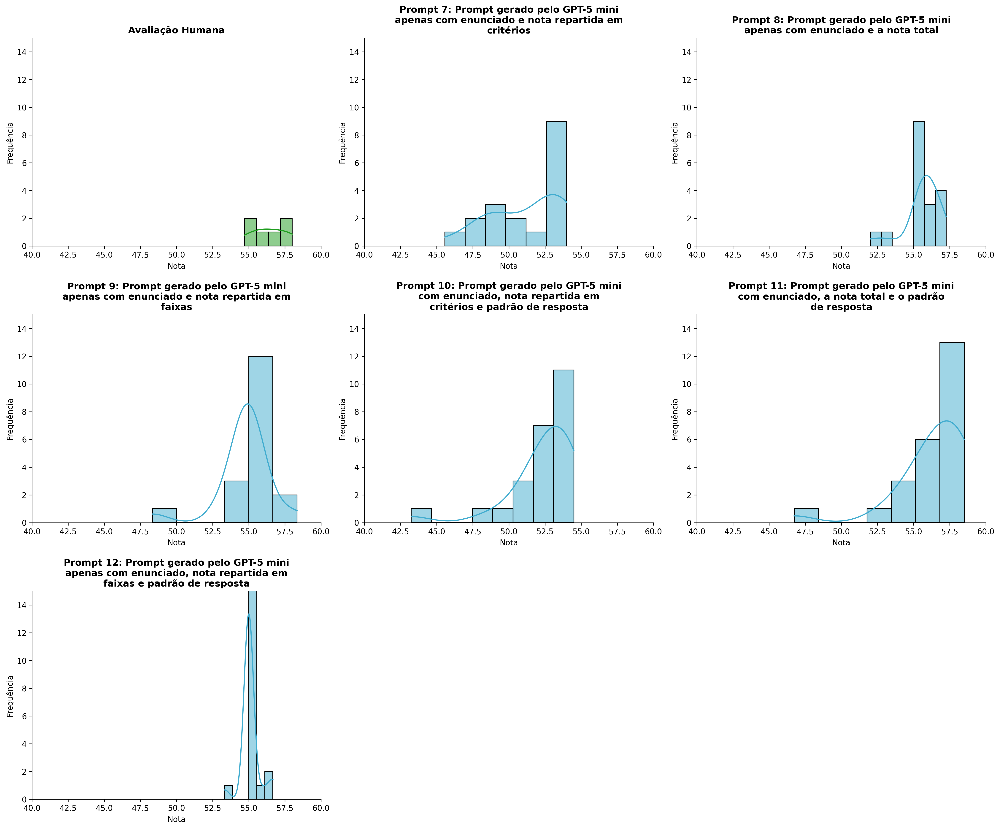
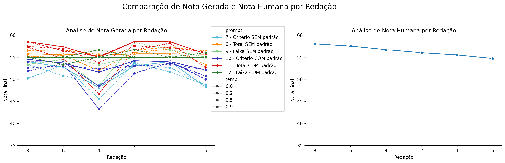
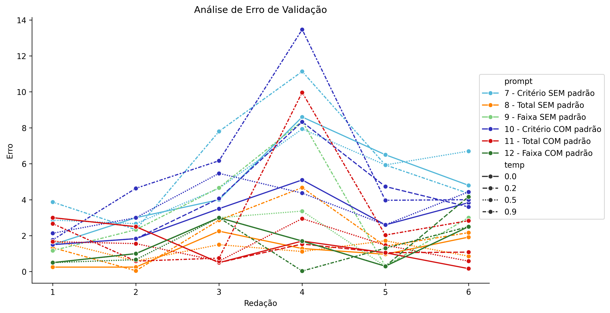
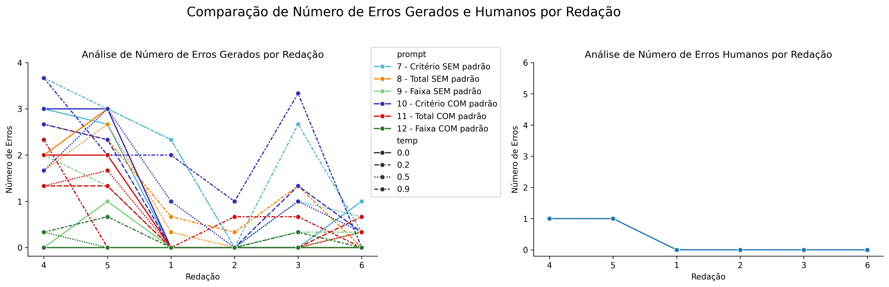

# Relatório de Avaliação: sabia-3.1_2022_FIX - 3 execuções
**Gerado em: 03/04/2026 15:46:09**

## 1. Distribuição de Notas
Nesta seção comparamos as notas atribuídas pelo modelo sabia em diferentes prompts/temperaturas versus a correção humana.

## 2. Comparação de Notas Geradas e Humanas
Nesta seção, apresentamos a comparação entre as notas finais geradas pelo modelo e as notas dadas por avaliadores humanos.

## 3. Análise de Erro Absoluto de Validação

<table>
  <tr>
    <td>
      
    </td>
    <td>
      <table border="1" class="dataframe">
  <thead>
    <tr style="text-align: center;">
      <th>prompt</th>
      <th>temp</th>
      <th>area_sob_curva</th>
      <th>mae</th>
      <th>rmse</th>
    </tr>
  </thead>
  <tbody>
    <tr>
      <td>7</td>
      <td>0.0</td>
      <td>25.2500</td>
      <td>4.7333</td>
      <td>5.2678</td>
    </tr>
    <tr>
      <td>7</td>
      <td>0.5</td>
      <td>25.9500</td>
      <td>5.1222</td>
      <td>5.4746</td>
    </tr>
    <tr>
      <td>7</td>
      <td>0.9</td>
      <td>31.3083</td>
      <td>5.9028</td>
      <td>6.5741</td>
    </tr>
    <tr>
      <td>8</td>
      <td>0.0</td>
      <td>5.8333</td>
      <td>1.1528</td>
      <td>1.3810</td>
    </tr>
    <tr>
      <td>8</td>
      <td>0.5</td>
      <td>6.2217</td>
      <td>1.2544</td>
      <td>1.3283</td>
    </tr>
    <tr>
      <td>8</td>
      <td>0.9</td>
      <td>10.7500</td>
      <td>2.0833</td>
      <td>2.5332</td>
    </tr>
    <tr>
      <td>9</td>
      <td>0.0</td>
      <td>7.5000</td>
      <td>1.5000</td>
      <td>1.8019</td>
    </tr>
    <tr>
      <td>9</td>
      <td>0.5</td>
      <td>9.1667</td>
      <td>1.7778</td>
      <td>2.1573</td>
    </tr>
    <tr>
      <td>9</td>
      <td>0.9</td>
      <td>17.7500</td>
      <td>3.3056</td>
      <td>4.2363</td>
    </tr>
    <tr>
      <td>10</td>
      <td>0.0</td>
      <td>15.7000</td>
      <td>3.0611</td>
      <td>3.2996</td>
    </tr>
    <tr>
      <td>10</td>
      <td>0.2</td>
      <td>21.5166</td>
      <td>4.0111</td>
      <td>4.5999</td>
    </tr>
    <tr>
      <td>10</td>
      <td>0.5</td>
      <td>18.7167</td>
      <td>3.6667</td>
      <td>3.8496</td>
    </tr>
    <tr>
      <td>10</td>
      <td>0.9</td>
      <td>31.1168</td>
      <td>5.6667</td>
      <td>6.7787</td>
    </tr>
    <tr>
      <td>11</td>
      <td>0.0</td>
      <td>7.3334</td>
      <td>1.4861</td>
      <td>1.8037</td>
    </tr>
    <tr>
      <td>11</td>
      <td>0.2</td>
      <td>7.6250</td>
      <td>1.6111</td>
      <td>1.8315</td>
    </tr>
    <tr>
      <td>11</td>
      <td>0.5</td>
      <td>7.6817</td>
      <td>1.4678</td>
      <td>1.6701</td>
    </tr>
    <tr>
      <td>11</td>
      <td>0.9</td>
      <td>16.0833</td>
      <td>3.1389</td>
      <td>4.4630</td>
    </tr>
    <tr>
      <td>12</td>
      <td>0.0</td>
      <td>7.5000</td>
      <td>1.5000</td>
      <td>1.8019</td>
    </tr>
    <tr>
      <td>12</td>
      <td>0.2</td>
      <td>8.3334</td>
      <td>1.7778</td>
      <td>2.2580</td>
    </tr>
    <tr>
      <td>12</td>
      <td>0.5</td>
      <td>7.1667</td>
      <td>1.4444</td>
      <td>1.7760</td>
    </tr>
    <tr>
      <td>12</td>
      <td>0.9</td>
      <td>6.8333</td>
      <td>1.3889</td>
      <td>1.7412</td>
    </tr>
  </tbody>
</table>
    </td>
  </tr>
</table>

## 4. Análise de Erros Gramaticais
Comparação da sensibilidade do modelo na detecção/geração de erros em relação ao padrão humano.

## 5. Correlação de Pearson
|           |       human |   p7, t0.0 |   p7, t0.5 |    p7, t0.9 |   p8, t0.0 |    p8, t0.5 |    p8, t0.9 |   p9, t0.0 |   p9, t0.5 |    p9, t0.9 |   p10, t0.0 |   p10, t0.2 |   p10, t0.5 |   p10, t0.9 |   p11, t0.0 |   p11, t0.2 |   p11, t0.5 |   p11, t0.9 |   p12, t0.0 |   p12, t0.2 |   p12, t0.5 |   p12, t0.9 |
|:----------|------------:|-----------:|-----------:|------------:|-----------:|------------:|------------:|-----------:|-----------:|------------:|------------:|------------:|------------:|------------:|------------:|------------:|------------:|------------:|------------:|------------:|------------:|------------:|
| human     |   1         |   0.409653 |   0.320109 |   0.0859175 |  -0.170903 |  -0.206536  |   0.0490919 |        nan |  -0.118278 |  -0.377475  |    0.387561 |    0.30843  |    0.108005 |  -0.0166769 |   0.243228  |    0.144343 |   0.0724001 |   0.0472004 |         nan |  -0.433685  |  -0.157704  |   -0.268222 |
| p7, t0.0  |   0.409653  |   1        |   0.934055 |   0.774733  |   0.704956 |   0.748524  |   0.920725  |        nan |   0.629902 |   0.581949  |    0.977135 |    0.963024 |    0.79005  |   0.747436  |   0.968321  |    0.900639 |   0.83084   |   0.888722  |         nan |  -0.182495  |   0.235478  |   -0.942307 |
| p7, t0.5  |   0.320109  |   0.934055 |   1        |   0.701572  |   0.781857 |   0.628332  |   0.855694  |        nan |   0.57029  |   0.610687  |    0.957979 |    0.892293 |    0.65231  |   0.604691  |   0.972405  |    0.977964 |   0.811714  |   0.858009  |         nan |   0.108509  |   0.466826  |   -0.862194 |
| p7, t0.9  |   0.0859175 |   0.774733 |   0.701572 |   1         |   0.666156 |   0.758743  |   0.880272  |        nan |   0.798381 |   0.856958  |    0.808789 |    0.908913 |    0.757432 |   0.846041  |   0.807181  |    0.671408 |   0.880776  |   0.812973  |         nan |  -0.429552  |   0.513219  |   -0.913269 |
| p8, t0.0  |  -0.170903  |   0.704956 |   0.781857 |   0.666156  |   1        |   0.80097   |   0.792502  |        nan |   0.866348 |   0.84352   |    0.787667 |    0.758652 |    0.401719 |   0.791104  |   0.840242  |    0.867672 |   0.912789  |   0.931806  |         nan |   0.254981  |   0.356753  |   -0.789672 |
| p8, t0.5  |  -0.206536  |   0.748524 |   0.628332 |   0.758743  |   0.80097  |   1         |   0.90957   |        nan |   0.833868 |   0.821015  |    0.720891 |    0.799093 |    0.738606 |   0.924633  |   0.780551  |    0.715262 |   0.832773  |   0.903978  |         nan |  -0.132039  |   0.0802104 |   -0.828797 |
| p8, t0.9  |   0.0490919 |   0.920725 |   0.855694 |   0.880272  |   0.792502 |   0.90957   |   1         |        nan |   0.751407 |   0.816205  |    0.90068  |    0.947661 |    0.870755 |   0.853263  |   0.941978  |    0.876278 |   0.88336   |   0.935607  |         nan |  -0.151735  |   0.347489  |   -0.941434 |
| p9, t0.0  | nan         | nan        | nan        | nan         | nan        | nan         | nan         |        nan | nan        | nan         |  nan        |  nan        |  nan        | nan         | nan         |  nan        | nan         | nan         |         nan | nan         | nan         |  nan        |
| p9, t0.5  |  -0.118278  |   0.629902 |   0.57029  |   0.798381  |   0.866348 |   0.833868  |   0.751407  |        nan |   1        |   0.860292  |    0.713051 |    0.773238 |    0.402634 |   0.951763  |   0.71573   |    0.626333 |   0.939494  |   0.884218  |         nan |  -0.2       |   0.2       |   -0.831528 |
| p9, t0.9  |  -0.377475  |   0.581949 |   0.610687 |   0.856958  |   0.84352  |   0.821015  |   0.816205  |        nan |   0.860292 |   1         |    0.651312 |    0.733857 |    0.571976 |   0.813431  |   0.721126  |    0.681623 |   0.863343  |   0.823092  |         nan |  -0.0198239 |   0.566916  |   -0.761208 |
| p10, t0.0 |   0.387561  |   0.977135 |   0.957979 |   0.808789  |   0.787667 |   0.720891  |   0.90068   |        nan |   0.713051 |   0.651312  |    1        |    0.973585 |    0.686753 |   0.769     |   0.984263  |    0.924648 |   0.901687  |   0.919936  |         nan |  -0.134417  |   0.339447  |   -0.96179  |
| p10, t0.2 |   0.30843   |   0.963024 |   0.892293 |   0.908913  |   0.758652 |   0.799093  |   0.947661  |        nan |   0.773238 |   0.733857  |    0.973585 |    1        |    0.779192 |   0.853966  |   0.961087  |    0.86085  |   0.924599  |   0.926658  |         nan |  -0.290498  |   0.341769  |   -0.994639 |
| p10, t0.5 |   0.108005  |   0.79005  |   0.65231  |   0.757432  |   0.401719 |   0.738606  |   0.870755  |        nan |   0.402634 |   0.571976  |    0.686753 |    0.779192 |    1        |   0.614315  |   0.729978  |    0.634122 |   0.565627  |   0.648122  |         nan |  -0.335534  |   0.2684    |   -0.74185  |
| p10, t0.9 |  -0.0166769 |   0.747436 |   0.604691 |   0.846041  |   0.791104 |   0.924633  |   0.853263  |        nan |   0.951763 |   0.813431  |    0.769    |    0.853966 |    0.614315 |   1         |   0.769711  |    0.646033 |   0.921147  |   0.909819  |         nan |  -0.351096  |   0.0803772 |   -0.899336 |
| p11, t0.0 |   0.243228  |   0.968321 |   0.972405 |   0.807181  |   0.840242 |   0.780551  |   0.941978  |        nan |   0.71573  |   0.721126  |    0.984263 |    0.961087 |    0.729978 |   0.769711  |   1         |    0.967621 |   0.903558  |   0.945054  |         nan |  -0.0219462 |   0.3908    |   -0.94765  |
| p11, t0.2 |   0.144343  |   0.900639 |   0.977964 |   0.671408  |   0.867672 |   0.715262  |   0.876278  |        nan |   0.626333 |   0.681623  |    0.924648 |    0.86085  |    0.634122 |   0.646033  |   0.967621  |    1        |   0.83124   |   0.901235  |         nan |   0.229357  |   0.432259  |   -0.841901 |
| p11, t0.5 |   0.0724001 |   0.83084  |   0.811714 |   0.880776  |   0.912789 |   0.832773  |   0.88336   |        nan |   0.939494 |   0.863343  |    0.901687 |    0.924599 |    0.565627 |   0.921147  |   0.903558  |    0.83124  |   1         |   0.967377  |         nan |  -0.144099  |   0.363097  |   -0.951544 |
| p11, t0.9 |   0.0472004 |   0.888722 |   0.858009 |   0.812973  |   0.931806 |   0.903978  |   0.935607  |        nan |   0.884218 |   0.823092  |    0.919936 |    0.926658 |    0.648122 |   0.909819  |   0.945054  |    0.901235 |   0.967377  |   1         |         nan |  -0.0374371 |   0.260096  |   -0.946013 |
| p12, t0.0 | nan         | nan        | nan        | nan         | nan        | nan         | nan         |        nan | nan        | nan         |  nan        |  nan        |  nan        | nan         | nan         |  nan        | nan         | nan         |         nan | nan         | nan         |  nan        |
| p12, t0.2 |  -0.433685  |  -0.182495 |   0.108509 |  -0.429552  |   0.254981 |  -0.132039  |  -0.151735  |        nan |  -0.2      |  -0.0198239 |   -0.134417 |   -0.290498 |   -0.335534 |  -0.351096  |  -0.0219462 |    0.229357 |  -0.144099  |  -0.0374371 |         nan |   1         |   0.2       |    0.302371 |
| p12, t0.5 |  -0.157704  |   0.235478 |   0.466826 |   0.513219  |   0.356753 |   0.0802104 |   0.347489  |        nan |   0.2      |   0.566916  |    0.339447 |    0.341769 |    0.2684   |   0.0803772 |   0.3908    |    0.432259 |   0.363097  |   0.260096  |         nan |   0.2       |   1         |   -0.302371 |
| p12, t0.9 |  -0.268222  |  -0.942307 |  -0.862194 |  -0.913269  |  -0.789672 |  -0.828797  |  -0.941434  |        nan |  -0.831528 |  -0.761208  |   -0.96179  |   -0.994639 |   -0.74185  |  -0.899336  |  -0.94765   |   -0.841901 |  -0.951544  |  -0.946013  |         nan |   0.302371  |  -0.302371  |    1        |

## 6. Correlação de Spearman
|           |       human |   p7, t0.0 |   p7, t0.5 |    p7, t0.9 |    p8, t0.0 |    p8, t0.5 |   p8, t0.9 |   p9, t0.0 |   p9, t0.5 |   p9, t0.9 |   p10, t0.0 |   p10, t0.2 |   p10, t0.5 |   p10, t0.9 |   p11, t0.0 |   p11, t0.2 |   p11, t0.5 |   p11, t0.9 |   p12, t0.0 |   p12, t0.2 |   p12, t0.5 |   p12, t0.9 |
|:----------|------------:|-----------:|-----------:|------------:|------------:|------------:|-----------:|-----------:|-----------:|-----------:|------------:|------------:|------------:|------------:|------------:|------------:|------------:|------------:|------------:|------------:|------------:|------------:|
| human     |   1         |   0.20292  |   0.463817 |   0.0857143 |  -0.0910765 |  -0.0285714 |  -0.142857 |        nan |  -0.130931 |  -0.6      |    0.371429 |  -0.0285714 |    0.142857 |    0.142857 |    0.151794 |    0.151794 |    0.2      |   0.0857143 |         nan |   -0.392792 |   -0.130931 |   -0.304256 |
| p7, t0.0  |   0.20292   |   1        |   0.882353 |   0.521794  |   0.89326   |   0.695725  |   0.753702 |        nan |   0.664211 |   0.40584  |    0.898645 |   0.811679  |    0.637748 |    0.782691 |    0.954864 |    0.954864 |    0.811679 |   0.985611  |         nan |    0.132842 |    0.132842 |   -0.857493 |
| p7, t0.5  |   0.463817  |   0.882353 |   1        |   0.579771  |   0.831655  |   0.463817  |   0.579771 |        nan |   0.531369 |   0.289886 |    0.985611 |   0.811679  |    0.463817 |    0.521794 |    0.924062 |    0.924062 |    0.927634 |   0.811679  |         nan |    0.132842 |    0.398527 |   -0.823193 |
| p7, t0.9  |   0.0857143 |   0.521794 |   0.579771 |   1         |   0.5161    |   0.771429  |   0.828571 |        nan |   0.654654 |   0.714286 |    0.6      |   0.828571  |    0.714286 |    0.6      |    0.698253 |    0.698253 |    0.771429 |   0.542857  |         nan |   -0.392792 |    0.654654 |   -0.845154 |
| p8, t0.0  |  -0.0910765 |   0.89326  |   0.831655 |   0.5161    |   1         |   0.5161    |   0.698253 |        nan |   0.695608 |   0.637536 |    0.880406 |   0.880406  |    0.394665 |    0.5161   |    0.935484 |    0.935484 |    0.880406 |   0.880406  |         nan |    0.417365 |    0.417365 |   -0.718421 |
| p8, t0.5  |  -0.0285714 |   0.695725 |   0.463817 |   0.771429  |   0.5161    |   1         |   0.942857 |        nan |   0.654654 |   0.6      |    0.485714 |   0.714286  |    0.942857 |    0.942857 |    0.698253 |    0.698253 |    0.542857 |   0.771429  |         nan |   -0.392792 |    0.130931 |   -0.845154 |
| p8, t0.9  |  -0.142857  |   0.753702 |   0.579771 |   0.828571  |   0.698253  |   0.942857  |   1        |        nan |   0.654654 |   0.771429 |    0.6      |   0.885714  |    0.885714 |    0.828571 |    0.819689 |    0.819689 |    0.714286 |   0.828571  |         nan |   -0.130931 |    0.392792 |   -0.845154 |
| p9, t0.0  | nan         | nan        | nan        | nan         | nan         | nan         | nan        |        nan | nan        | nan        |  nan        | nan         |  nan        |  nan        |  nan        |  nan        |  nan        | nan         |         nan |  nan        |  nan        |  nan        |
| p9, t0.5  |  -0.130931  |   0.664211 |   0.531369 |   0.654654  |   0.695608  |   0.654654  |   0.654654 |        nan |   1        |   0.654654 |    0.654654 |   0.654654  |    0.392792 |    0.654654 |    0.695608 |    0.695608 |    0.654654 |   0.654654  |         nan |   -0.2      |    0.2      |   -0.774597 |
| p9, t0.9  |  -0.6       |   0.40584  |   0.289886 |   0.714286  |   0.637536  |   0.6       |   0.771429 |        nan |   0.654654 |   1        |    0.371429 |   0.771429  |    0.428571 |    0.371429 |    0.576818 |    0.576818 |    0.6      |   0.485714  |         nan |    0.130931 |    0.654654 |   -0.507093 |
| p10, t0.0 |   0.371429  |   0.898645 |   0.985611 |   0.6       |   0.880406  |   0.485714  |   0.6      |        nan |   0.654654 |   0.371429 |    1        |   0.828571  |    0.428571 |    0.542857 |    0.941124 |    0.941124 |    0.942857 |   0.828571  |         nan |    0.130931 |    0.392792 |   -0.845154 |
| p10, t0.2 |  -0.0285714 |   0.811679 |   0.811679 |   0.828571  |   0.880406  |   0.714286  |   0.885714 |        nan |   0.654654 |   0.771429 |    0.828571 |   1         |    0.657143 |    0.6      |    0.941124 |    0.941124 |    0.942857 |   0.828571  |         nan |    0.130931 |    0.654654 |   -0.845154 |
| p10, t0.5 |   0.142857  |   0.637748 |   0.463817 |   0.714286  |   0.394665  |   0.942857  |   0.885714 |        nan |   0.392792 |   0.428571 |    0.428571 |   0.657143  |    1        |    0.885714 |    0.637536 |    0.637536 |    0.485714 |   0.714286  |         nan |   -0.392792 |    0.130931 |   -0.777542 |
| p10, t0.9 |   0.142857  |   0.782691 |   0.521794 |   0.6       |   0.5161    |   0.942857  |   0.828571 |        nan |   0.654654 |   0.371429 |    0.542857 |   0.6       |    0.885714 |    1        |    0.698253 |    0.698253 |    0.485714 |   0.828571  |         nan |   -0.392792 |   -0.130931 |   -0.845154 |
| p11, t0.0 |   0.151794  |   0.954864 |   0.924062 |   0.698253  |   0.935484  |   0.698253  |   0.819689 |        nan |   0.695608 |   0.576818 |    0.941124 |   0.941124  |    0.637536 |    0.698253 |    1        |    1        |    0.941124 |   0.941124  |         nan |    0.139122 |    0.417365 |   -0.898027 |
| p11, t0.2 |   0.151794  |   0.954864 |   0.924062 |   0.698253  |   0.935484  |   0.698253  |   0.819689 |        nan |   0.695608 |   0.576818 |    0.941124 |   0.941124  |    0.637536 |    0.698253 |    1        |    1        |    0.941124 |   0.941124  |         nan |    0.139122 |    0.417365 |   -0.898027 |
| p11, t0.5 |   0.2       |   0.811679 |   0.927634 |   0.771429  |   0.880406  |   0.542857  |   0.714286 |        nan |   0.654654 |   0.6      |    0.942857 |   0.942857  |    0.485714 |    0.485714 |    0.941124 |    0.941124 |    1        |   0.771429  |         nan |    0.130931 |    0.654654 |   -0.845154 |
| p11, t0.9 |   0.0857143 |   0.985611 |   0.811679 |   0.542857  |   0.880406  |   0.771429  |   0.828571 |        nan |   0.654654 |   0.485714 |    0.828571 |   0.828571  |    0.714286 |    0.828571 |    0.941124 |    0.941124 |    0.771429 |   1         |         nan |    0.130931 |    0.130931 |   -0.845154 |
| p12, t0.0 | nan         | nan        | nan        | nan         | nan         | nan         | nan        |        nan | nan        | nan        |  nan        | nan         |  nan        |  nan        |  nan        |  nan        |  nan        | nan         |         nan |  nan        |  nan        |  nan        |
| p12, t0.2 |  -0.392792  |   0.132842 |   0.132842 |  -0.392792  |   0.417365  |  -0.392792  |  -0.130931 |        nan |  -0.2      |   0.130931 |    0.130931 |   0.130931  |   -0.392792 |   -0.392792 |    0.139122 |    0.139122 |    0.130931 |   0.130931  |         nan |    1        |    0.2      |    0.309839 |
| p12, t0.5 |  -0.130931  |   0.132842 |   0.398527 |   0.654654  |   0.417365  |   0.130931  |   0.392792 |        nan |   0.2      |   0.654654 |    0.392792 |   0.654654  |    0.130931 |   -0.130931 |    0.417365 |    0.417365 |    0.654654 |   0.130931  |         nan |    0.2      |    1        |   -0.309839 |
| p12, t0.9 |  -0.304256  |  -0.857493 |  -0.823193 |  -0.845154  |  -0.718421  |  -0.845154  |  -0.845154 |        nan |  -0.774597 |  -0.507093 |   -0.845154 |  -0.845154  |   -0.777542 |   -0.845154 |   -0.898027 |   -0.898027 |   -0.845154 |  -0.845154  |         nan |    0.309839 |   -0.309839 |    1        |

## Estatísticas Descritivas
### Modelo sabia-3.1_2022_FIX
|       |    prompt |       temp |   redacao |   nota_final |   nota_final_std |        1A |        1B |        1C |     CGPL |   num_errors |
|:------|----------:|-----------:|----------:|-------------:|-----------------:|----------:|----------:|----------:|---------:|-------------:|
| count | 126       | 126        | 126       |    126       |        126       | 44        | 44        | 44        | 44       |   126        |
| mean  |   9.71429 |   0.428571 |   3.5     |     54.2539  |          1.35239 |  8.73107  |  8.75379  | 17.3561   | 16.9436  |     0.806875 |
| std   |   1.70109 |   0.35482  |   1.71464 |      2.72215 |          1.73401 |  0.384148 |  0.384605 |  0.917529 |  1.20847 |     1.08596  |
| min   |   7       |   0        |   1       |     43.2333  |          0       |  8        |  8        | 13.8333   | 12.7333  |     0        |
| 25%   |   8       |   0        |   2       |     53.3333  |          0       |  8.5      |  8.45833  | 17        | 16.475   |     0        |
| 50%   |  10       |   0.5      |   3.5     |     55       |          0.5508  |  8.75     |  9        | 17.8333   | 17.325   |     0.16665  |
| 75%   |  11       |   0.9      |   5       |     55.75    |          2.2535  |  9        |  9        | 18        | 18       |     1.3333   |
| max   |  12       |   0.9      |   6       |     58.5     |          8.7237  |  9.3333   |  9.5      | 18        | 18       |     3.6667   |

### Humano
|       |   redacao |   nota_final |        1A |        1B |        1C |      CGPL |   num_errors |
|:------|----------:|-------------:|----------:|----------:|----------:|----------:|-------------:|
| count |   6       |      6       |  6        |  6        |  6        |  6        |     6        |
| mean  |   3.5     |     56.4     |  9.75     |  9.75     | 18.5      | 18.4      |     0.333333 |
| std   |   1.87083 |      1.24258 |  0.273861 |  0.273861 |  0.447214 |  0.532917 |     0.516398 |
| min   |   1       |     54.7     |  9.5      |  9.5      | 18        | 17.7      |     0        |
| 25%   |   2.25    |     55.625   |  9.5      |  9.5      | 18.125    | 18.05     |     0        |
| 50%   |   3.5     |     56.35    |  9.75     |  9.75     | 18.5      | 18.35     |     0        |
| 75%   |   4.75    |     57.3     | 10        | 10        | 18.875    | 18.875    |     0.75     |
| max   |   6       |     58       | 10        | 10        | 19        | 19        |     1        |
