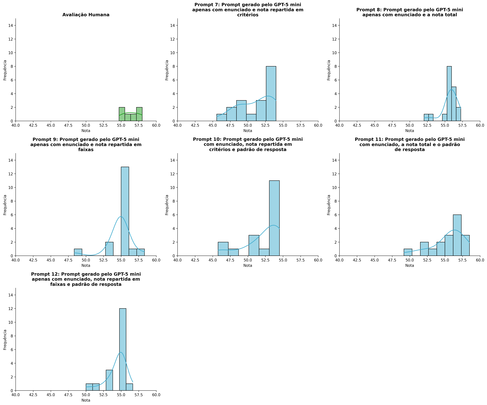
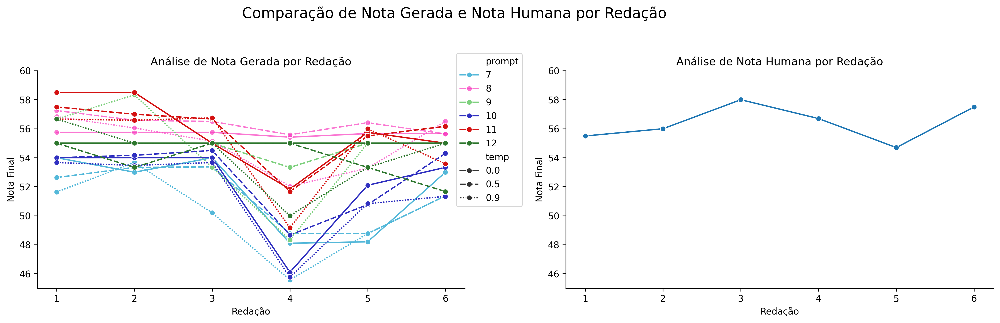
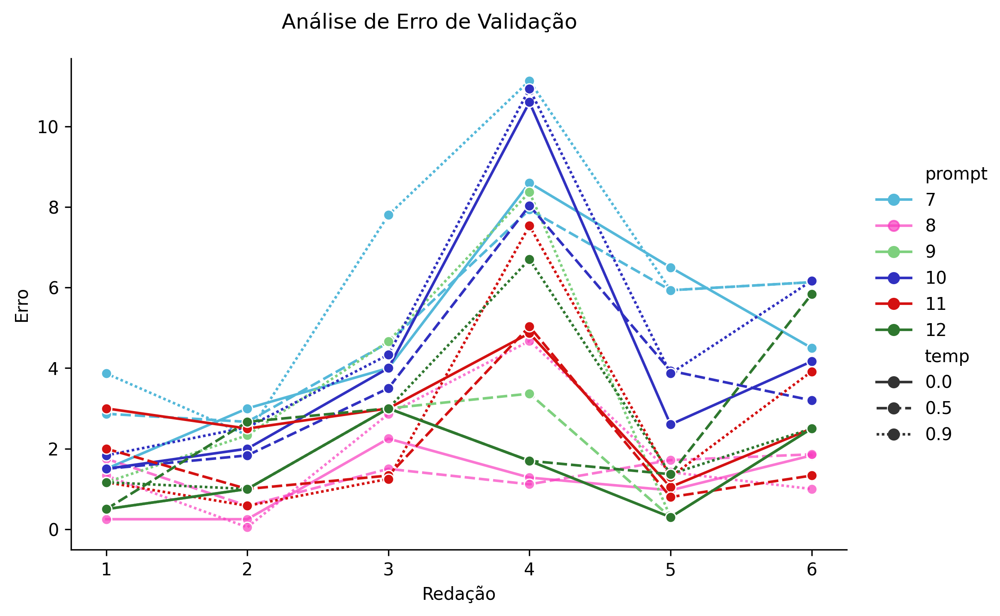

# Relatório de Avaliação: sabia-3.1 - 3 execuções
**Gerado em: 26/01/2026 17:28:16**

## 1. Distribuição de Notas
Nesta seção comparamos as notas atribuídas pelo modelo sabia em diferentes prompts/temperaturas versus a correção humana.

## 2. Comparação de Notas Geradas e Humanas
Nesta seção, apresentamos a comparação entre as notas finais geradas pelo modelo e as notas dadas por avaliadores humanos.

## 3. Análise de Erro Absoluto de Validação

<table>
  <tr>
    <td>
      
    </td>
    <td>
      <table border="1" class="dataframe">
  <thead>
    <tr style="text-align: center;">
      <th>prompt</th>
      <th>temp</th>
      <th>area_sob_curva</th>
      <th>mae</th>
      <th>rmse</th>
    </tr>
  </thead>
  <tbody>
    <tr>
      <td>7</td>
      <td>0.0</td>
      <td>25.1000</td>
      <td>4.6833</td>
      <td>5.2235</td>
    </tr>
    <tr>
      <td>7</td>
      <td>0.5</td>
      <td>25.6666</td>
      <td>5.0278</td>
      <td>5.3628</td>
    </tr>
    <tr>
      <td>7</td>
      <td>0.9</td>
      <td>32.1999</td>
      <td>6.2000</td>
      <td>6.8070</td>
    </tr>
    <tr>
      <td>8</td>
      <td>0.0</td>
      <td>5.7917</td>
      <td>1.1389</td>
      <td>1.3620</td>
    </tr>
    <tr>
      <td>8</td>
      <td>0.5</td>
      <td>6.7217</td>
      <td>1.4211</td>
      <td>1.4892</td>
    </tr>
    <tr>
      <td>8</td>
      <td>0.9</td>
      <td>10.1667</td>
      <td>1.8889</td>
      <td>2.4085</td>
    </tr>
    <tr>
      <td>9</td>
      <td>0.0</td>
      <td>7.5000</td>
      <td>1.5000</td>
      <td>1.8019</td>
    </tr>
    <tr>
      <td>9</td>
      <td>0.5</td>
      <td>9.1667</td>
      <td>1.7778</td>
      <td>2.1573</td>
    </tr>
    <tr>
      <td>9</td>
      <td>0.9</td>
      <td>17.5000</td>
      <td>3.2222</td>
      <td>4.1818</td>
    </tr>
    <tr>
      <td>10</td>
      <td>0.0</td>
      <td>22.0334</td>
      <td>4.1444</td>
      <td>5.1435</td>
    </tr>
    <tr>
      <td>10</td>
      <td>0.5</td>
      <td>19.6499</td>
      <td>3.6667</td>
      <td>4.2447</td>
    </tr>
    <tr>
      <td>10</td>
      <td>0.9</td>
      <td>25.6666</td>
      <td>4.9444</td>
      <td>5.7890</td>
    </tr>
    <tr>
      <td>11</td>
      <td>0.0</td>
      <td>14.1667</td>
      <td>2.8194</td>
      <td>3.0355</td>
    </tr>
    <tr>
      <td>11</td>
      <td>0.5</td>
      <td>9.8333</td>
      <td>1.9167</td>
      <td>2.3989</td>
    </tr>
    <tr>
      <td>11</td>
      <td>0.9</td>
      <td>13.2083</td>
      <td>2.6250</td>
      <td>3.5834</td>
    </tr>
    <tr>
      <td>12</td>
      <td>0.0</td>
      <td>7.5000</td>
      <td>1.5000</td>
      <td>1.8019</td>
    </tr>
    <tr>
      <td>12</td>
      <td>0.5</td>
      <td>11.9001</td>
      <td>2.5111</td>
      <td>3.0317</td>
    </tr>
    <tr>
      <td>12</td>
      <td>0.9</td>
      <td>13.9001</td>
      <td>2.6222</td>
      <td>3.2754</td>
    </tr>
  </tbody>
</table>
    </td>
  </tr>
</table>

## 4. Análise de Erros Gramaticais
Comparação da sensibilidade do modelo na detecção/geração de erros em relação ao padrão humano.

## 5. Correlação de Pearson
|           |        human |    p7, t0.0 |    p7, t0.5 |    p7, t0.9 |    p8, t0.0 |   p8, t0.5 |   p8, t0.9 |   p9, t0.0 |   p9, t0.5 |   p9, t0.9 |    p10, t0.0 |   p10, t0.5 |    p10, t0.9 |   p11, t0.0 |   p11, t0.5 |   p11, t0.9 |   p12, t0.0 |   p12, t0.5 |   p12, t0.9 |
|:----------|-------------:|------------:|------------:|------------:|------------:|-----------:|-----------:|-----------:|-----------:|-----------:|-------------:|------------:|-------------:|------------:|------------:|------------:|------------:|------------:|------------:|
| human     |   1          |   0.42498   |   0.3688    |  -0.0199899 |  -0.0623566 |  -0.457182 |   0.153098 |        nan |  -0.118278 |  -0.350653 |   0.00656414 |    0.327892 |  -0.00210707 |   -0.433841 |  -0.0722752 |  -0.232628  |         nan |  -0.0197004 |   -0.011675 |
| p7, t0.0  |   0.42498    |   1         |   0.950687  |   0.794037  |   0.770266  |   0.490934 |   0.912306 |        nan |   0.633041 |   0.589254 |   0.791612   |    0.950907 |   0.825999   |    0.605502 |   0.806485  |   0.608848  |         nan |  -0.0291663 |    0.86315  |
| p7, t0.5  |   0.3688     |   0.950687  |   1         |   0.815514  |   0.784602  |   0.551178 |   0.817237 |        nan |   0.595254 |   0.614569 |   0.767098   |    0.905695 |   0.842909   |    0.652111 |   0.783682  |   0.661255  |         nan |   0.0748826 |    0.790526 |
| p7, t0.9  |  -0.0199899  |   0.794037  |   0.815514  |   1         |   0.86952   |   0.538163 |   0.903098 |        nan |   0.813203 |   0.93312  |   0.889561   |    0.890915 |   0.874358   |    0.876499 |   0.901166  |   0.758948  |         nan |  -0.38321   |    0.871561 |
| p8, t0.0  |  -0.0623566  |   0.770266  |   0.784602  |   0.86952   |   1         |   0.734989 |   0.801225 |        nan |   0.948715 |   0.875012 |   0.985401   |    0.883724 |   0.993882   |    0.84746  |   0.986619  |   0.96694   |         nan |  -0.158197  |    0.936584 |
| p8, t0.5  |  -0.457182   |   0.490934  |   0.551178  |   0.538163  |   0.734989  |   1        |   0.497459 |        nan |   0.580343 |   0.652462 |   0.632725   |    0.471654 |   0.749312   |    0.82697  |   0.724385  |   0.809274  |         nan |   0.40301   |    0.707754 |
| p8, t0.9  |   0.153098   |   0.912306  |   0.817237  |   0.903098  |   0.801225  |   0.497459 |   1        |        nan |   0.749857 |   0.78647  |   0.852185   |    0.93449  |   0.82649    |    0.75861  |   0.876685  |   0.637643  |         nan |  -0.311142  |    0.933932 |
| p9, t0.0  | nan          | nan         | nan         | nan         | nan         | nan        | nan        |        nan | nan        | nan        | nan          |  nan        | nan          |  nan        | nan         | nan         |         nan | nan         |  nan        |
| p9, t0.5  |  -0.118278   |   0.633041  |   0.595254  |   0.813203  |   0.948715  |   0.580343 |   0.749857 |        nan |   1        |   0.869627 |   0.971198   |    0.818259 |   0.913016   |    0.766085 |   0.945636  |   0.917318  |         nan |  -0.400004  |    0.88852  |
| p9, t0.9  |  -0.350653   |   0.589254  |   0.614569  |   0.93312   |   0.875012  |   0.652462 |   0.78647  |        nan |   0.869627 |   1        |   0.876594   |    0.741009 |   0.849388   |    0.951266 |   0.900158  |   0.838013  |         nan |  -0.395291  |    0.842927 |
| p10, t0.0 |   0.00656414 |   0.791612  |   0.767098  |   0.889561  |   0.985401  |   0.632725 |   0.852185 |        nan |   0.971198 |   0.876594 |   1          |    0.92114  |   0.97501    |    0.809453 |   0.988229  |   0.920858  |         nan |  -0.29539   |    0.951715 |
| p10, t0.5 |   0.327892   |   0.950907  |   0.905695  |   0.890915  |   0.883724  |   0.471654 |   0.93449  |        nan |   0.818259 |   0.741009 |   0.92114    |    1        |   0.908412   |    0.681488 |   0.907788  |   0.738526  |         nan |  -0.261572  |    0.919727 |
| p10, t0.9 |  -0.00210707 |   0.825999  |   0.842909  |   0.874358  |   0.993882  |   0.749312 |   0.82649  |        nan |   0.913016 |   0.849388 |   0.97501    |    0.908412 |   1          |    0.842647 |   0.983214  |   0.94822   |         nan |  -0.0918308 |    0.945916 |
| p11, t0.0 |  -0.433841   |   0.605502  |   0.652111  |   0.876499  |   0.84746   |   0.82697  |   0.75861  |        nan |   0.766085 |   0.951266 |   0.809453   |    0.681488 |   0.842647   |    1        |   0.874263  |   0.835734  |         nan |  -0.11641   |    0.839429 |
| p11, t0.5 |  -0.0722752  |   0.806485  |   0.783682  |   0.901166  |   0.986619  |   0.724385 |   0.876685 |        nan |   0.945636 |   0.900158 |   0.988229   |    0.907788 |   0.983214   |    0.874263 |   1         |   0.927771  |         nan |  -0.212289  |    0.977397 |
| p11, t0.9 |  -0.232628   |   0.608848  |   0.661255  |   0.758948  |   0.96694   |   0.809274 |   0.637643 |        nan |   0.917318 |   0.838013 |   0.920858   |    0.738526 |   0.94822    |    0.835734 |   0.927771  |   1         |         nan |  -0.0475638 |    0.847257 |
| p12, t0.0 | nan          | nan         | nan         | nan         | nan         | nan        | nan        |        nan | nan        | nan        | nan          |  nan        | nan          |  nan        | nan         | nan         |         nan | nan         |  nan        |
| p12, t0.5 |  -0.0197004  |  -0.0291663 |   0.0748826 |  -0.38321   |  -0.158197  |   0.40301  |  -0.311142 |        nan |  -0.400004 |  -0.395291 |  -0.29539    |   -0.261572 |  -0.0918308  |   -0.11641  |  -0.212289  |  -0.0475638 |         nan |   1         |   -0.177699 |
| p12, t0.9 |  -0.011675   |   0.86315   |   0.790526  |   0.871561  |   0.936584  |   0.707754 |   0.933932 |        nan |   0.88852  |   0.842927 |   0.951715   |    0.919727 |   0.945916   |    0.839429 |   0.977397  |   0.847257  |         nan |  -0.177699  |    1        |

## 6. Correlação de Spearman
|           |       human |   p7, t0.0 |   p7, t0.5 |    p7, t0.9 |    p8, t0.0 |   p8, t0.5 |    p8, t0.9 |   p9, t0.0 |   p9, t0.5 |   p9, t0.9 |   p10, t0.0 |   p10, t0.5 |   p10, t0.9 |   p11, t0.0 |   p11, t0.5 |   p11, t0.9 |   p12, t0.0 |   p12, t0.5 |   p12, t0.9 |
|:----------|------------:|-----------:|-----------:|------------:|------------:|-----------:|------------:|-----------:|-----------:|-----------:|------------:|------------:|------------:|------------:|------------:|------------:|------------:|------------:|------------:|
| human     |   1         |   0.26482  |   0.463817 |  -0.0857143 |   0.0308607 |  -0.314286 |  -0.0285714 |        nan |  -0.130931 |  -0.492805 |    0.151794 |   0.657143  |    0.20292  |  -0.617914  |  -0.0857143 |   0.0857143 |         nan |   0.092582  |   0.0303588 |
| p7, t0.0  |   0.26482   |   1        |   0.835914 |   0.617914  |   0.874007  |   0.765037 |   0.735612  |        nan |   0.6742   |   0.373176 |    0.906693 |   0.735612  |    0.985184 |   0.454545  |   0.85331   |   0.882735  |         nan |   0.238366  |   0.906693  |
| p7, t0.5  |   0.463817  |   0.835914 |   1        |   0.637748  |   0.89237   |   0.666737 |   0.463817  |        nan |   0.531369 |   0.338235 |    0.924062 |   0.811679  |    0.882353 |   0.358249  |   0.753702  |   0.840668  |         nan |   0.203523  |   0.677645  |
| p7, t0.9  |  -0.0857143 |   0.617914 |   0.637748 |   1         |   0.771517  |   0.771429 |   0.828571  |        nan |   0.654654 |   0.898645 |    0.819689 |   0.485714  |    0.666737 |   0.794461  |   0.885714  |   0.485714  |         nan |  -0.277746  |   0.819689  |
| p8, t0.0  |   0.0308607 |   0.874007 |   0.89237  |   0.771517  |   1         |   0.92582  |   0.617213  |        nan |   0.707107 |   0.626224 |    0.983739 |   0.617213  |    0.939336 |   0.715097  |   0.92582   |   0.92582   |         nan |   0.183333  |   0.819782  |
| p8, t0.5  |  -0.314286  |   0.765037 |   0.666737 |   0.771429  |   0.92582   |   1        |   0.657143  |        nan |   0.654654 |   0.753702 |    0.880406 |   0.314286  |    0.840668 |   0.882735  |   0.942857  |   0.828571  |         nan |   0.216025  |   0.819689  |
| p8, t0.9  |  -0.0285714 |   0.735612 |   0.463817 |   0.828571  |   0.617213  |   0.657143 |   1         |        nan |   0.654654 |   0.695725 |    0.698253 |   0.485714  |    0.695725 |   0.617914  |   0.828571  |   0.428571  |         nan |  -0.216025  |   0.941124  |
| p9, t0.0  | nan         | nan        | nan        | nan         | nan         | nan        | nan         |        nan | nan        | nan        |  nan        | nan         |  nan        | nan         | nan         | nan         |         nan | nan         | nan         |
| p9, t0.5  |  -0.130931  |   0.6742   |   0.531369 |   0.654654  |   0.707107  |   0.654654 |   0.654654  |        nan |   1        |   0.664211 |    0.695608 |   0.654654  |    0.664211 |   0.6742    |   0.654654  |   0.654654  |         nan |  -0.424264  |   0.695608  |
| p9, t0.9  |  -0.492805  |   0.373176 |   0.338235 |   0.898645  |   0.626224  |   0.753702 |   0.695725  |        nan |   0.664211 |   1        |    0.616041 |   0.173931  |    0.441176 |   0.940403  |   0.753702  |   0.347863  |         nan |  -0.39139   |   0.646843  |
| p10, t0.0 |   0.151794  |   0.906693 |   0.924062 |   0.819689  |   0.983739  |   0.880406 |   0.698253  |        nan |   0.695608 |   0.616041 |    1        |   0.698253  |    0.954864 |   0.656571  |   0.941124  |   0.880406  |         nan |   0.131165  |   0.870968  |
| p10, t0.5 |   0.657143  |   0.735612 |   0.811679 |   0.485714  |   0.617213  |   0.314286 |   0.485714  |        nan |   0.654654 |   0.173931 |    0.698253 |   1         |    0.695725 |   0.0882735 |   0.485714  |   0.6       |         nan |  -0.216025  |   0.576818  |
| p10, t0.9 |   0.20292   |   0.985184 |   0.882353 |   0.666737  |   0.939336  |   0.840668 |   0.695725  |        nan |   0.664211 |   0.441176 |    0.954864 |   0.695725  |    1        |   0.537373  |   0.898645  |   0.927634  |         nan |   0.281801  |   0.89326   |
| p11, t0.0 |  -0.617914  |   0.454545 |   0.358249 |   0.794461  |   0.715097  |   0.882735 |   0.617914  |        nan |   0.6742   |   0.940403 |    0.656571 |   0.0882735 |    0.537373 |   1         |   0.794461  |   0.529641  |         nan |  -0.143019  |   0.656571  |
| p11, t0.5 |  -0.0857143 |   0.85331  |   0.753702 |   0.885714  |   0.92582   |   0.942857 |   0.828571  |        nan |   0.654654 |   0.753702 |    0.941124 |   0.485714  |    0.898645 |   0.794461  |   1         |   0.771429  |         nan |   0.123443  |   0.941124  |
| p11, t0.9 |   0.0857143 |   0.882735 |   0.840668 |   0.485714  |   0.92582   |   0.828571 |   0.428571  |        nan |   0.654654 |   0.347863 |    0.880406 |   0.6       |    0.927634 |   0.529641  |   0.771429  |   1         |         nan |   0.370328  |   0.698253  |
| p12, t0.0 | nan         | nan        | nan        | nan         | nan         | nan        | nan         |        nan | nan        | nan        |  nan        | nan         |  nan        | nan         | nan         | nan         |         nan | nan         | nan         |
| p12, t0.5 |   0.092582  |   0.238366 |   0.203523 |  -0.277746  |   0.183333  |   0.216025 |  -0.216025  |        nan |  -0.424264 |  -0.39139  |    0.131165 |  -0.216025  |    0.281801 |  -0.143019  |   0.123443  |   0.370328  |         nan |   1         |   0.0327913 |
| p12, t0.9 |   0.0303588 |   0.906693 |   0.677645 |   0.819689  |   0.819782  |   0.819689 |   0.941124  |        nan |   0.695608 |   0.646843 |    0.870968 |   0.576818  |    0.89326  |   0.656571  |   0.941124  |   0.698253  |         nan |   0.0327913 |   1         |

## Estatísticas Descritivas
### Modelo sabia-3.1
|       |    prompt |       temp |   redacao |   nota_final |        1A |        1B |        1C |     CGPL |   num_errors |
|:------|----------:|-----------:|----------:|-------------:|----------:|----------:|----------:|---------:|-------------:|
| count | 108       | 108        | 108       |    108       | 36        | 36        | 36        | 36       |   108        |
| mean  |   9.5     |   0.466667 |   3.5     |     53.9016  |  8.68983  |  8.71296  | 17.3194   | 16.9     |     0.827157 |
| std   |   1.71579 |   0.369895 |   1.71579 |      2.69945 |  0.421929 |  0.377152 |  0.954009 |  1.30185 |     1.13975  |
| min   |   7       |   0        |   1       |     45.5667  |  8        |  8        | 15        | 14.1     |     0        |
| 25%   |   8       |   0        |   2       |     53.2125  |  8.45833  |  8.3333   | 16.8333   | 16.0083  |     0        |
| 50%   |   9.5     |   0.5      |   3.5     |     55       |  8.83335  |  9        | 18        | 17.3     |     0        |
| 75%   |  11       |   0.9      |   5       |     55.5975  |  9        |  9        | 18        | 18       |     1.3333   |
| max   |  12       |   0.9      |   6       |     58.5     |  9.1667   |  9.1667   | 18.1667   | 18.1667  |     3.6667   |

### Humano
|       |   redacao |   nota_final |        1A |        1B |        1C |      CGPL |   num_errors |
|:------|----------:|-------------:|----------:|----------:|----------:|----------:|-------------:|
| count |   6       |      6       |  6        |  6        |  6        |  6        |     6        |
| mean  |   3.5     |     56.4     |  9.75     |  9.75     | 18.5      | 18.4      |     0.333333 |
| std   |   1.87083 |      1.24258 |  0.273861 |  0.273861 |  0.447214 |  0.532917 |     0.516398 |
| min   |   1       |     54.7     |  9.5      |  9.5      | 18        | 17.7      |     0        |
| 25%   |   2.25    |     55.625   |  9.5      |  9.5      | 18.125    | 18.05     |     0        |
| 50%   |   3.5     |     56.35    |  9.75     |  9.75     | 18.5      | 18.35     |     0        |
| 75%   |   4.75    |     57.3     | 10        | 10        | 18.875    | 18.875    |     0.75     |
| max   |   6       |     58       | 10        | 10        | 19        | 19        |     1        |
