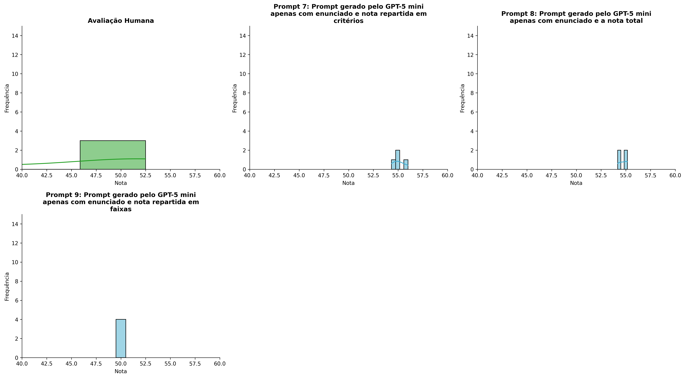
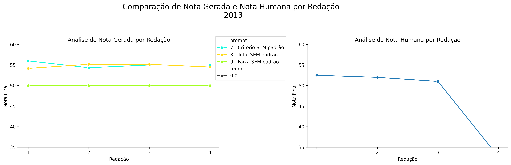
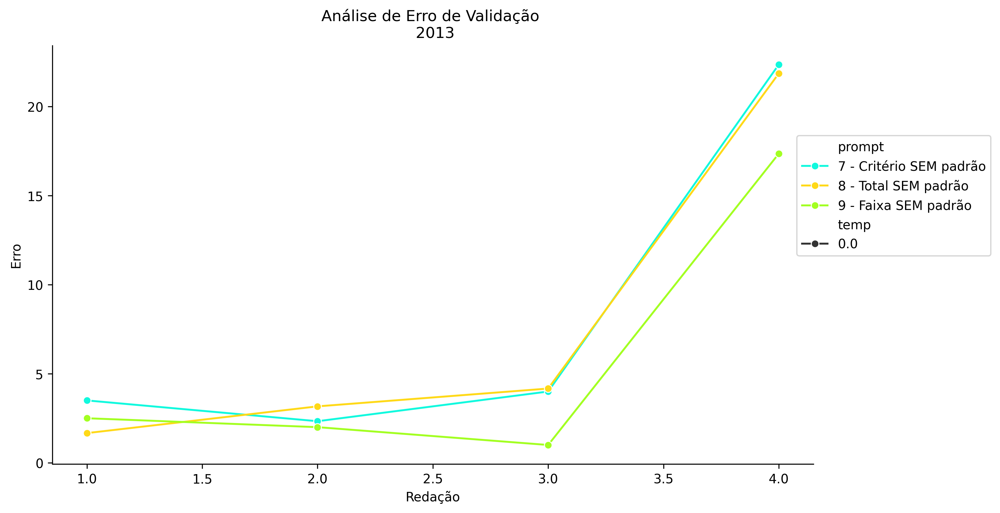
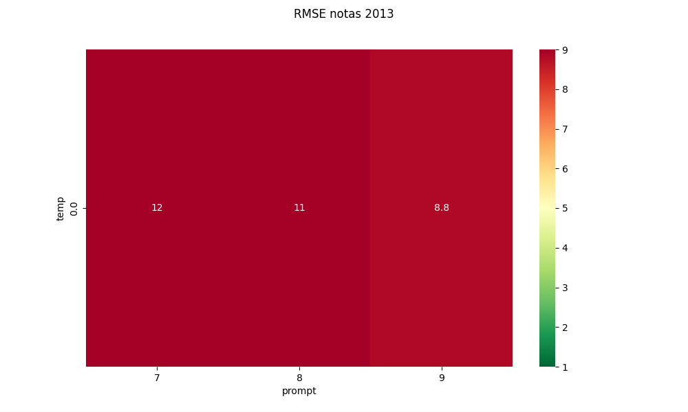
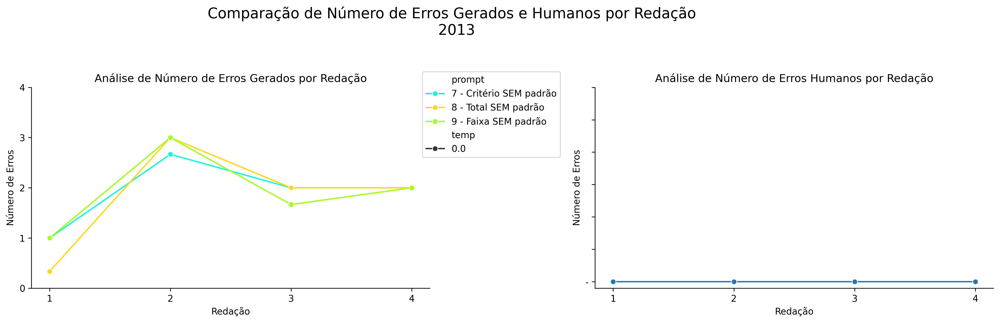
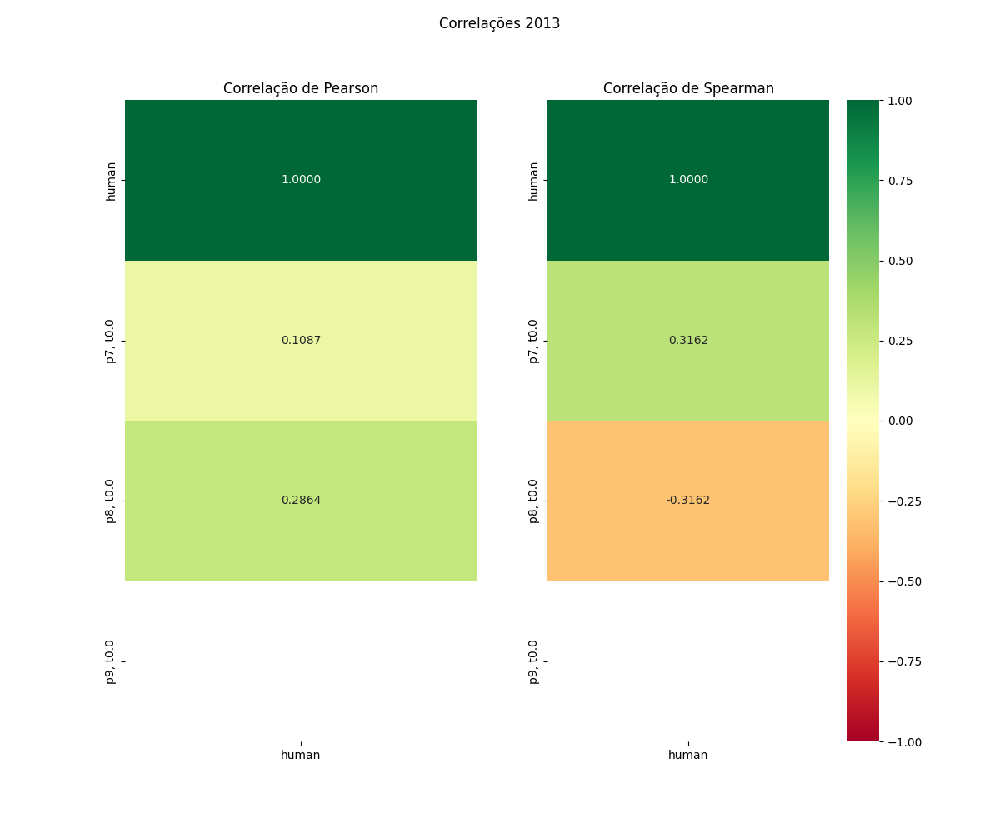

# Relatório de Avaliação: sabia-4 - 3 execuções
**Gerado em: 20/05/2026 13:28:40**

## 1. Distribuição de Notas
Nesta seção comparamos as notas atribuídas pelo modelo sabia-4 em diferentes prompts/temperaturas versus a correção humana.

## 2. Comparação de Notas Geradas e Humanas
Nesta seção, apresentamos a comparação entre as notas finais geradas pelo modelo e as notas dadas por avaliadores humanos.

## 3. Análise de Erro Absoluto de Validação

<table>
  <tr>
    <td>
      
    </td>
    <td>
      <table border="1" class="dataframe">
  <thead>
    <tr style="text-align: center;">
      <th>prompt</th>
      <th>temp</th>
      <th>area_sob_curva</th>
      <th>mae</th>
      <th>rmse</th>
    </tr>
  </thead>
  <tbody>
    <tr>
      <td>7</td>
      <td>0.0</td>
      <td>19.2583</td>
      <td>8.0458</td>
      <td>11.5457</td>
    </tr>
    <tr>
      <td>8</td>
      <td>0.0</td>
      <td>19.0917</td>
      <td>7.7125</td>
      <td>11.2649</td>
    </tr>
    <tr>
      <td>9</td>
      <td>0.0</td>
      <td>12.9250</td>
      <td>5.7125</td>
      <td>8.8356</td>
    </tr>
  </tbody>
</table>
    </td>
  </tr>
</table>

## 4. Análise de RMSE por Prompt e Temperatura
Nesta seção, apresentamos o heatmap de RMSE calculado por combinação de prompt e temperatura.

## 5. Análise de Erros Gramaticais
Comparação da sensibilidade do modelo na detecção/geração de erros em relação ao padrão humano.

## 6. Correlações

## Estatísticas Descritivas
### Modelo sabia-4
|       |    prompt |   temp |   redacao |   nota_final |   nota_final_std |   1A |   1B |   1C |      CGPL |   num_errors |
|:------|----------:|-------:|----------:|-------------:|-----------------:|-----:|-----:|-----:|----------:|-------------:|
| count | 12        |     12 |  12       |     12       |        12        |    4 |    4 |    4 |  4        |    12        |
| mean  |  8        |      0 |   2.5     |     53.2778  |         0.264625 |    9 |    9 |    9 | 28.0833   |     1.88889  |
| std   |  0.852803 |      0 |   1.16775 |      2.46525 |         0.451572 |    0 |    0 |    0 |  0.687196 |     0.808215 |
| min   |  7        |      0 |   1       |     50       |         0        |    9 |    9 |    9 | 27.3333   |     0.3333   |
| 25%   |  7        |      0 |   1.75    |     50       |         0        |    9 |    9 |    9 | 27.8333   |     1.50002  |
| 50%   |  8        |      0 |   2.5     |     54.4167  |         0        |    9 |    9 |    9 | 28        |     2        |
| 75%   |  9        |      0 |   3.25    |     55.0417  |         0.360875 |    9 |    9 |    9 | 28.25     |     2.16668  |
| max   |  9        |      0 |   4       |     56       |         1.1547   |    9 |    9 |    9 | 29        |     3        |

### Humano
|       |   redacao |   nota_final |
|:------|----------:|-------------:|
| count |   4       |      4       |
| mean  |   2.5     |     47.0375  |
| std   |   1.29099 |      9.61192 |
| min   |   1       |     32.65    |
| 25%   |   1.75    |     46.4125  |
| 50%   |   2.5     |     51.5     |
| 75%   |   3.25    |     52.125   |
| max   |   4       |     52.5     |
