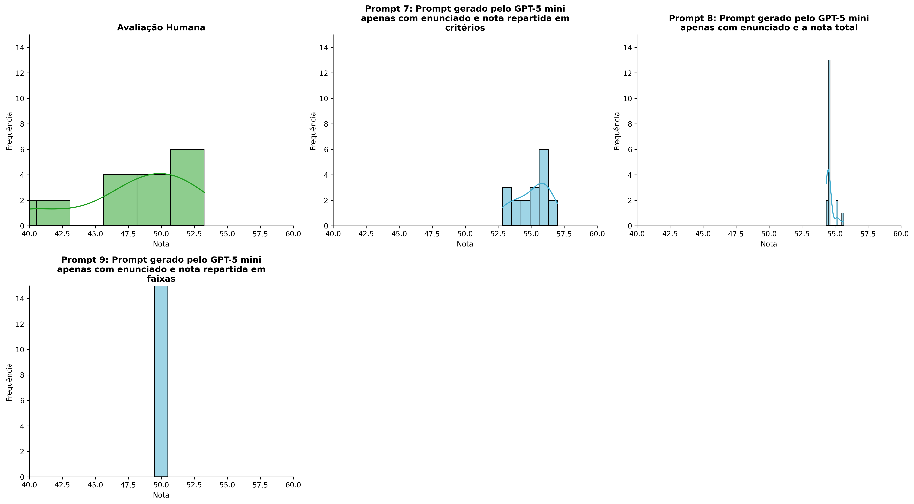
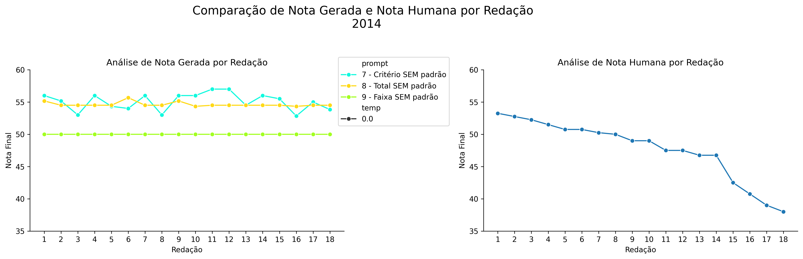
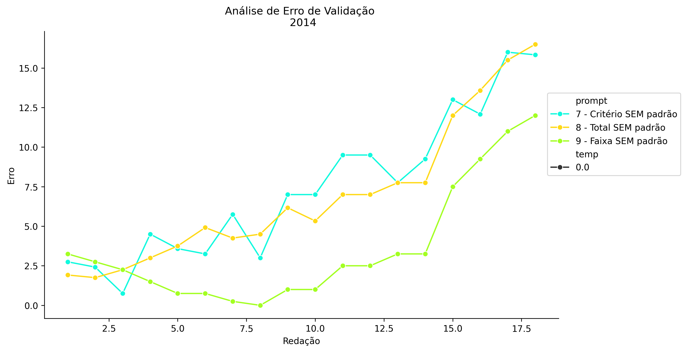
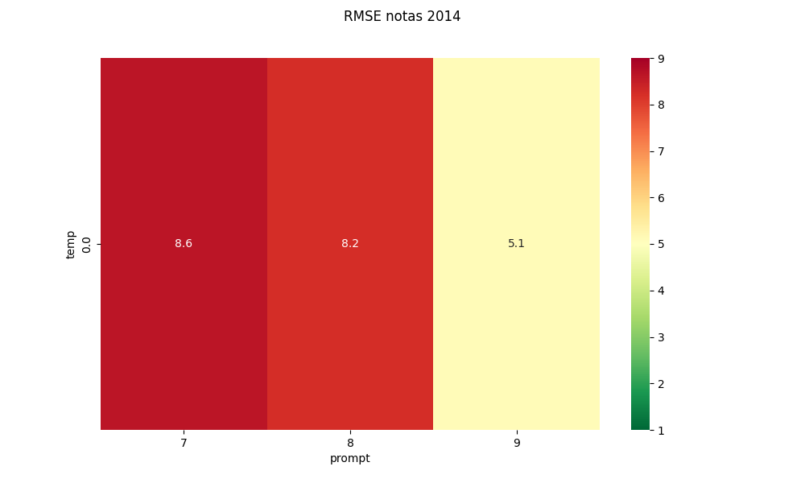
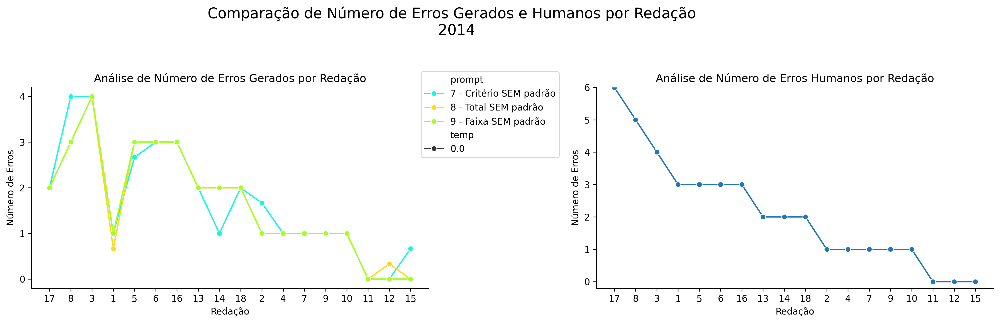
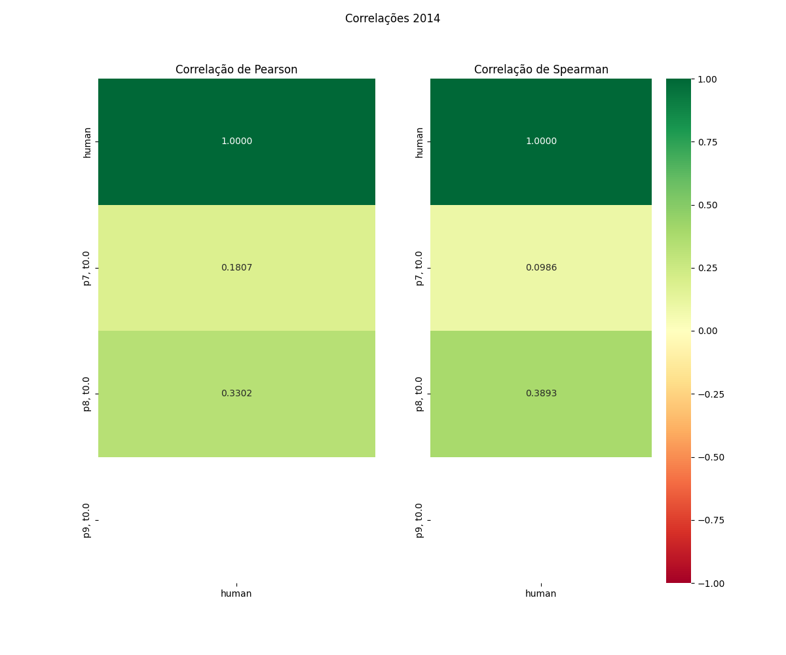

# Relatório de Avaliação: sabia-4 - 3 execuções
**Gerado em: 20/05/2026 13:28:44**

## 1. Distribuição de Notas
Nesta seção comparamos as notas atribuídas pelo modelo sabia-4 em diferentes prompts/temperaturas versus a correção humana.

## 2. Comparação de Notas Geradas e Humanas
Nesta seção, apresentamos a comparação entre as notas finais geradas pelo modelo e as notas dadas por avaliadores humanos.

## 3. Análise de Erro Absoluto de Validação

<table>
  <tr>
    <td>
      
    </td>
    <td>
      <table border="1" class="dataframe">
  <thead>
    <tr style="text-align: center;">
      <th>prompt</th>
      <th>temp</th>
      <th>area_sob_curva</th>
      <th>mae</th>
      <th>rmse</th>
    </tr>
  </thead>
  <tbody>
    <tr>
      <td>7</td>
      <td>0.0</td>
      <td>123.6250</td>
      <td>7.3843</td>
      <td>8.6458</td>
    </tr>
    <tr>
      <td>8</td>
      <td>0.0</td>
      <td>115.7084</td>
      <td>6.9398</td>
      <td>8.2427</td>
    </tr>
    <tr>
      <td>9</td>
      <td>0.0</td>
      <td>57.1250</td>
      <td>3.5972</td>
      <td>5.1048</td>
    </tr>
  </tbody>
</table>
    </td>
  </tr>
</table>

## 4. Análise de RMSE por Prompt e Temperatura
Nesta seção, apresentamos o heatmap de RMSE calculado por combinação de prompt e temperatura.

## 5. Análise de Erros Gramaticais
Comparação da sensibilidade do modelo na detecção/geração de erros em relação ao padrão humano.

## 6. Correlações

## Estatísticas Descritivas
### Modelo sabia-4
|       |    prompt |   temp |   redacao |   nota_final |   nota_final_std |         1A |         1B |       1C |     CGPL |   num_errors |
|:------|----------:|-------:|----------:|-------------:|-----------------:|-----------:|-----------:|---------:|---------:|-------------:|
| count | 54        |     54 |  54       |     54       |        54        | 18         | 18         | 18       | 18       |     54       |
| mean  |  8        |      0 |   9.5     |     53.2284  |         0.166683 |  8.98148   |  8.96296   |  8.84259 | 28.2778  |      1.68519 |
| std   |  0.824163 |      0 |   5.23684 |      2.43862 |         0.363417 |  0.0785596 |  0.0913857 |  0.28852 |  1.21133 |      1.16988 |
| min   |  7        |      0 |   1       |     50       |         0        |  8.6667    |  8.6667    |  8.1667  | 26       |      0       |
| 25%   |  7        |      0 |   5       |     50       |         0        |  9         |  9         |  8.87497 | 27.5     |      1       |
| 50%   |  8        |      0 |   9.5     |     54.5     |         0        |  9         |  9         |  9       | 28.6667  |      1.33335 |
| 75%   |  9        |      0 |  14       |     54.875   |         0        |  9         |  9         |  9       | 29       |      2.91668 |
| max   |  9        |      0 |  18       |     57       |         1.1547   |  9         |  9         |  9       | 30       |      4       |

### Humano
|       |   redacao |   nota_final |   num_errors |
|:------|----------:|-------------:|-------------:|
| count |  18       |     18       |     18       |
| mean  |   9.5     |     47.6806  |      2.11111 |
| std   |   5.33854 |      4.67928 |      1.71117 |
| min   |   1       |     38       |      0       |
| 25%   |   5.25    |     46.75    |      1       |
| 50%   |   9.5     |     49       |      2       |
| 75%   |  13.75    |     50.75    |      3       |
| max   |  18       |     53.25    |      6       |
