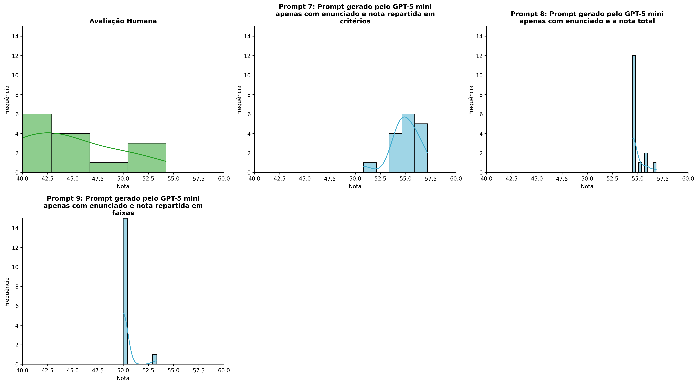
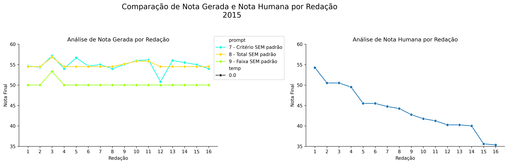
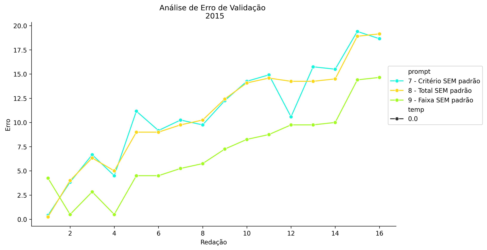
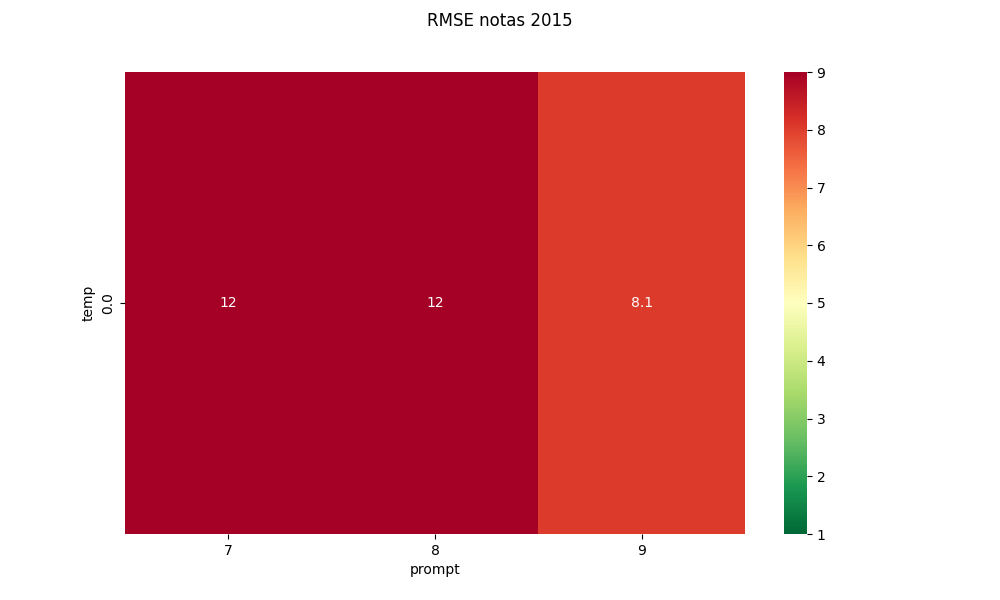
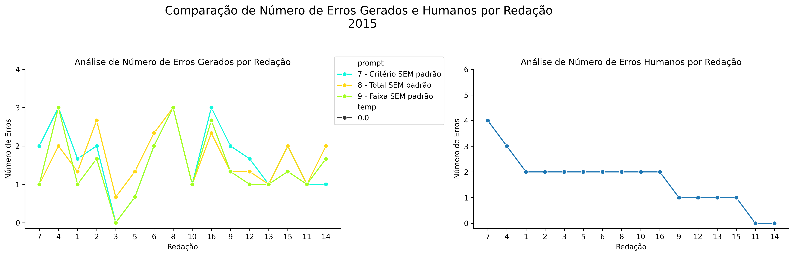
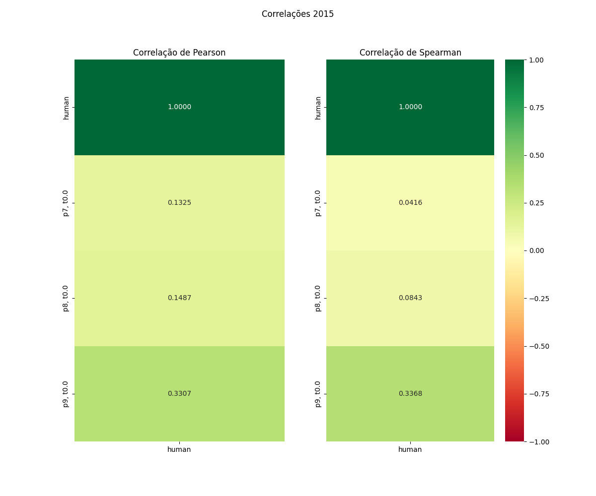

# Relatório de Avaliação: sabia-4 - 3 execuções
**Gerado em: 20/05/2026 13:28:48**

## 1. Distribuição de Notas
Nesta seção comparamos as notas atribuídas pelo modelo sabia-4 em diferentes prompts/temperaturas versus a correção humana.

## 2. Comparação de Notas Geradas e Humanas
Nesta seção, apresentamos a comparação entre as notas finais geradas pelo modelo e as notas dadas por avaliadores humanos.

## 3. Análise de Erro Absoluto de Validação

<table>
  <tr>
    <td>
      
    </td>
    <td>
      <table border="1" class="dataframe">
  <thead>
    <tr style="text-align: center;">
      <th>prompt</th>
      <th>temp</th>
      <th>area_sob_curva</th>
      <th>mae</th>
      <th>rmse</th>
    </tr>
  </thead>
  <tbody>
    <tr>
      <td>7</td>
      <td>0.0</td>
      <td>167.5168</td>
      <td>11.0656</td>
      <td>12.2182</td>
    </tr>
    <tr>
      <td>8</td>
      <td>0.0</td>
      <td>166.0166</td>
      <td>10.9823</td>
      <td>12.1161</td>
    </tr>
    <tr>
      <td>9</td>
      <td>0.0</td>
      <td>101.4333</td>
      <td>6.9302</td>
      <td>8.0507</td>
    </tr>
  </tbody>
</table>
    </td>
  </tr>
</table>

## 4. Análise de RMSE por Prompt e Temperatura
Nesta seção, apresentamos o heatmap de RMSE calculado por combinação de prompt e temperatura.

## 5. Análise de Erros Gramaticais
Comparação da sensibilidade do modelo na detecção/geração de erros em relação ao padrão humano.

## 6. Correlações

## Estatísticas Descritivas
### Modelo sabia-4
|       |    prompt |   temp |   redacao |   nota_final |   nota_final_std |        1A |        1B |       1C |     CGPL |   num_errors |
|:------|----------:|-------:|----------:|-------------:|-----------------:|----------:|----------:|---------:|---------:|-------------:|
| count | 48        |     48 |  48       |      48      |        48        | 16        | 16        | 16       | 16       |    48        |
| mean  |  8        |      0 |   8.5     |      53.3333 |         0.241838 |  8.9375   |  8.92709  |  8.76042 | 28.3125  |     1.59722  |
| std   |  0.825137 |      0 |   4.65855 |       2.4596 |         0.582424 |  0.257304 |  0.384753 |  0.52694 |  0.87321 |     0.795847 |
| min   |  7        |      0 |   1       |      50      |         0        |  8        |  7.5      |  7       | 27       |     0        |
| 25%   |  7        |      0 |   4.75    |      50      |         0        |  9        |  9        |  8.62503 | 28       |     1        |
| 50%   |  8        |      0 |   8.5     |      54.5    |         0        |  9        |  9        |  9       | 28.1667  |     1.3333   |
| 75%   |  9        |      0 |  12.25    |      55      |         0.072175 |  9        |  9        |  9       | 29       |     2        |
| max   |  9        |      0 |  16       |      57.1667 |         2.8868   |  9.1667   |  9.1667   |  9.1667  | 30       |     3        |

### Humano
|       |   redacao |   nota_final |   num_errors |
|:------|----------:|-------------:|-------------:|
| count |  16       |     16       |     16       |
| mean  |   8.5     |     43.8719  |      1.6875  |
| std   |   4.76095 |      5.34397 |      1.01448 |
| min   |   1       |     35.35    |      0       |
| 25%   |   4.75    |     40.25    |      1       |
| 50%   |   8.5     |     43.5     |      2       |
| 75%   |  12.25    |     46.5     |      2       |
| max   |  16       |     54.25    |      4       |
