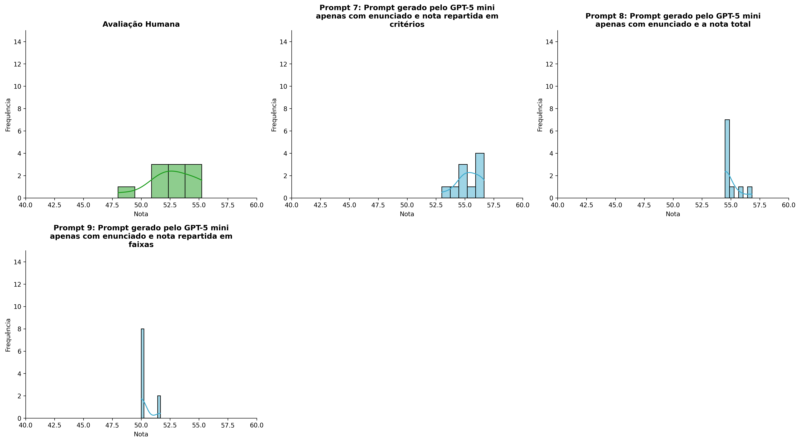
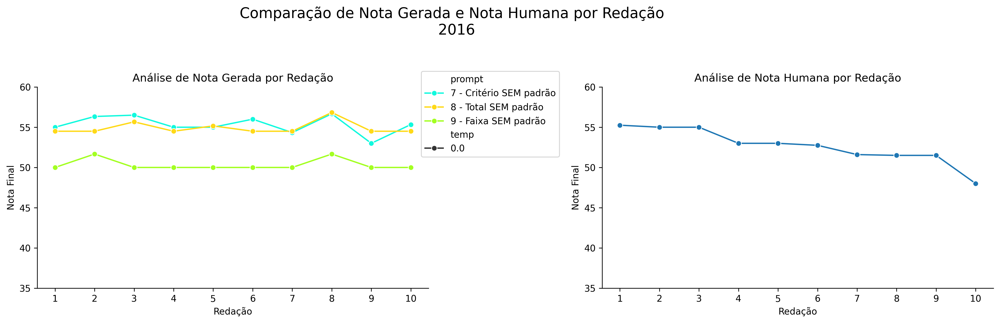
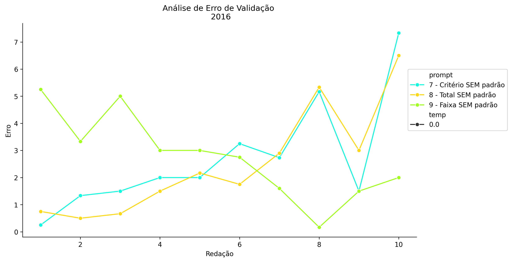
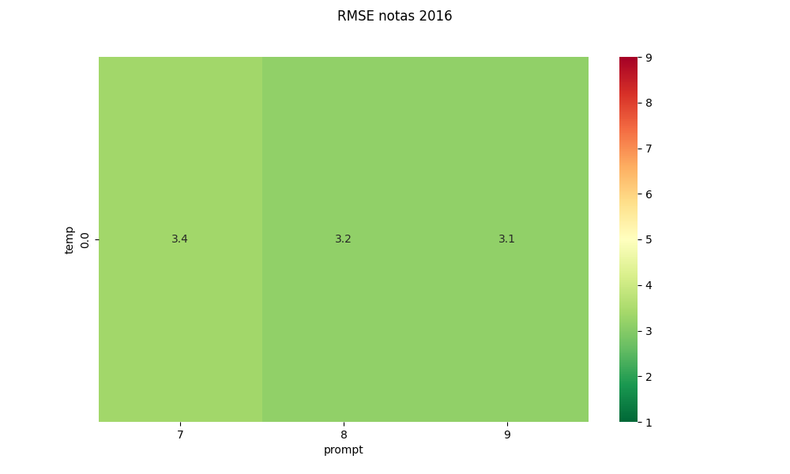
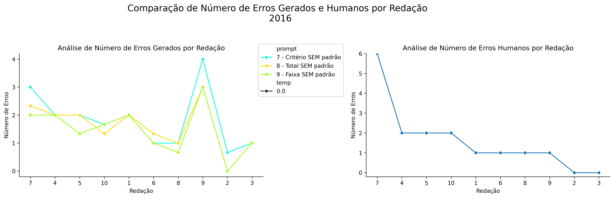
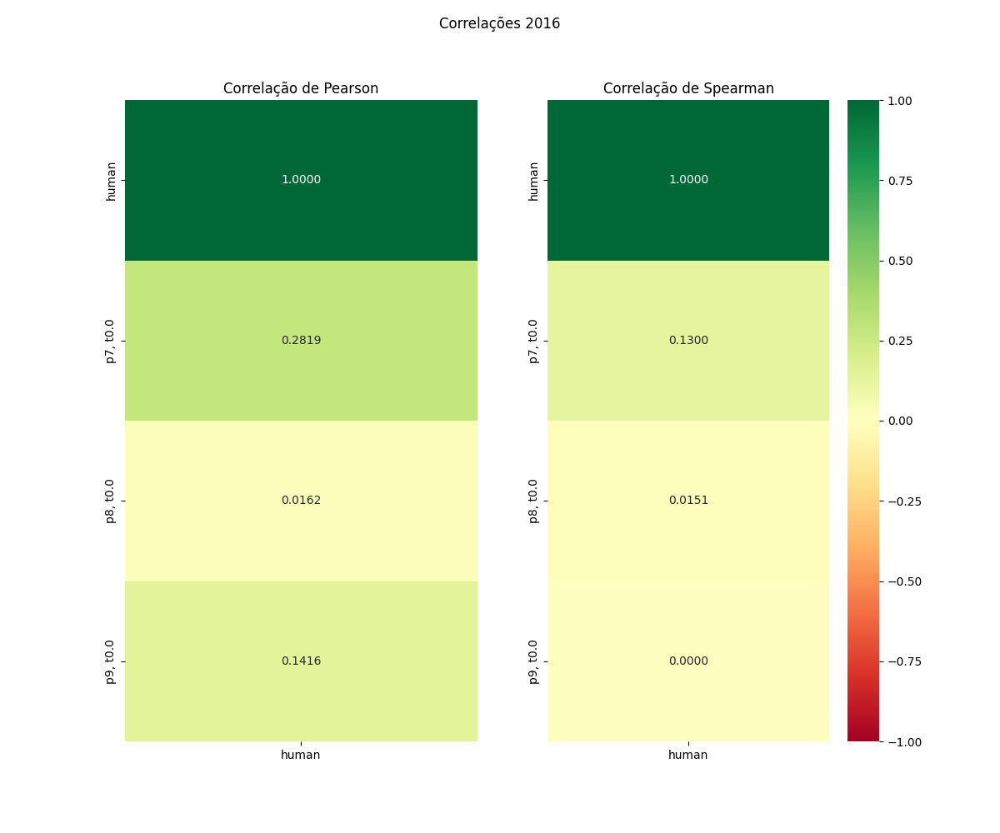

# Relatório de Avaliação: sabia-4 - 3 execuções
**Gerado em: 20/05/2026 13:28:51**

## 1. Distribuição de Notas
Nesta seção comparamos as notas atribuídas pelo modelo sabia-4 em diferentes prompts/temperaturas versus a correção humana.

## 2. Comparação de Notas Geradas e Humanas
Nesta seção, apresentamos a comparação entre as notas finais geradas pelo modelo e as notas dadas por avaliadores humanos.

## 3. Análise de Erro Absoluto de Validação

<table>
  <tr>
    <td>
      
    </td>
    <td>
      <table border="1" class="dataframe">
  <thead>
    <tr style="text-align: center;">
      <th>prompt</th>
      <th>temp</th>
      <th>area_sob_curva</th>
      <th>mae</th>
      <th>rmse</th>
    </tr>
  </thead>
  <tbody>
    <tr>
      <td>7</td>
      <td>0.0</td>
      <td>23.2750</td>
      <td>2.7067</td>
      <td>3.3593</td>
    </tr>
    <tr>
      <td>8</td>
      <td>0.0</td>
      <td>21.4417</td>
      <td>2.5067</td>
      <td>3.1523</td>
    </tr>
    <tr>
      <td>9</td>
      <td>0.0</td>
      <td>23.9750</td>
      <td>2.7600</td>
      <td>3.1317</td>
    </tr>
  </tbody>
</table>
    </td>
  </tr>
</table>

## 4. Análise de RMSE por Prompt e Temperatura
Nesta seção, apresentamos o heatmap de RMSE calculado por combinação de prompt e temperatura.

## 5. Análise de Erros Gramaticais
Comparação da sensibilidade do modelo na detecção/geração de erros em relação ao padrão humano.

## 6. Correlações

## Estatísticas Descritivas
### Modelo sabia-4
|       |    prompt |   temp |   redacao |   nota_final |   nota_final_std |   1A |        1B |         1C |     CGPL |   num_errors |
|:------|----------:|-------:|----------:|-------------:|-----------------:|-----:|----------:|-----------:|---------:|-------------:|
| count | 30        |     30 |  30       |     30       |        30        |   10 | 10        | 10         | 10       |    30        |
| mean  |  8        |      0 |   5.5     |     53.5222  |         0.342623 |    9 |  9.13333  |  9.01667   | 28.1667  |     1.63333  |
| std   |  0.830455 |      0 |   2.92138 |      2.45407 |         0.759514 |    0 |  0.219423 |  0.0527152 |  1.03339 |     0.894211 |
| min   |  7        |      0 |   1       |     50       |         0        |    9 |  9        |  9         | 26       |     0        |
| 25%   |  7        |      0 |   3       |     50.4167  |         0        |    9 |  9        |  9         | 28       |     1        |
| 50%   |  8        |      0 |   5.5     |     54.5     |         0        |    9 |  9        |  9         | 28.1667  |     1.6667   |
| 75%   |  9        |      0 |   8       |     55.125   |         0.2887   |    9 |  9.24997  |  9         | 29       |     2        |
| max   |  9        |      0 |  10       |     56.8333  |         2.8868   |    9 |  9.5      |  9.1667    | 29.3333  |     4        |

### Humano
|       |   redacao |   nota_final |   num_errors |
|:------|----------:|-------------:|-------------:|
| count |  10       |     10       |      10      |
| mean  |   5.5     |     52.66    |       1.6    |
| std   |   3.02765 |      2.19669 |       1.7127 |
| min   |   1       |     48       |       0      |
| 25%   |   3.25    |     51.525   |       1      |
| 50%   |   5.5     |     52.875   |       1      |
| 75%   |   7.75    |     54.5     |       2      |
| max   |  10       |     55.25    |       6      |
