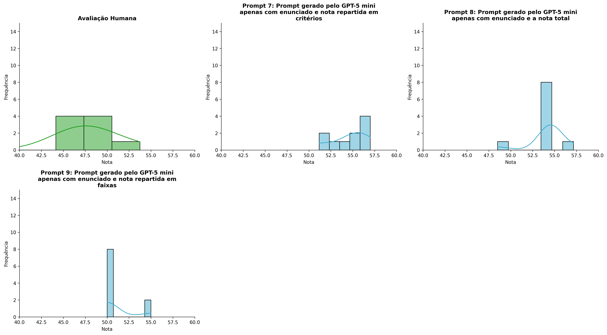
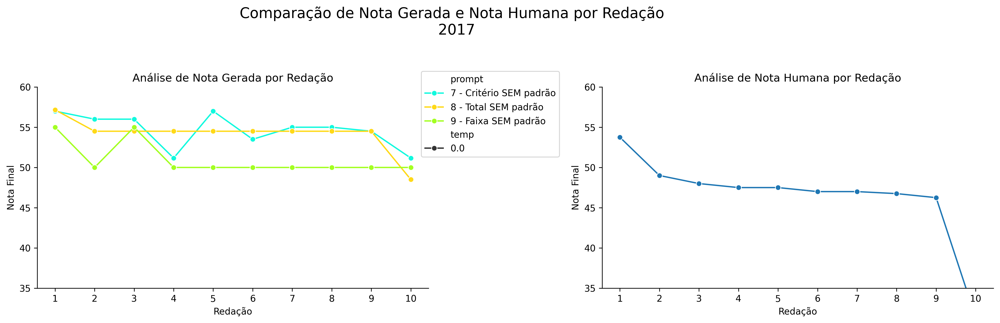
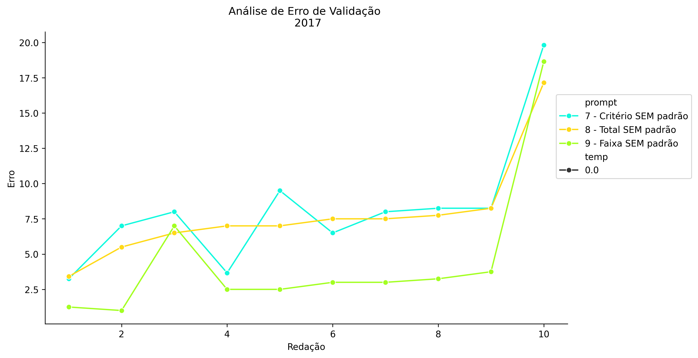
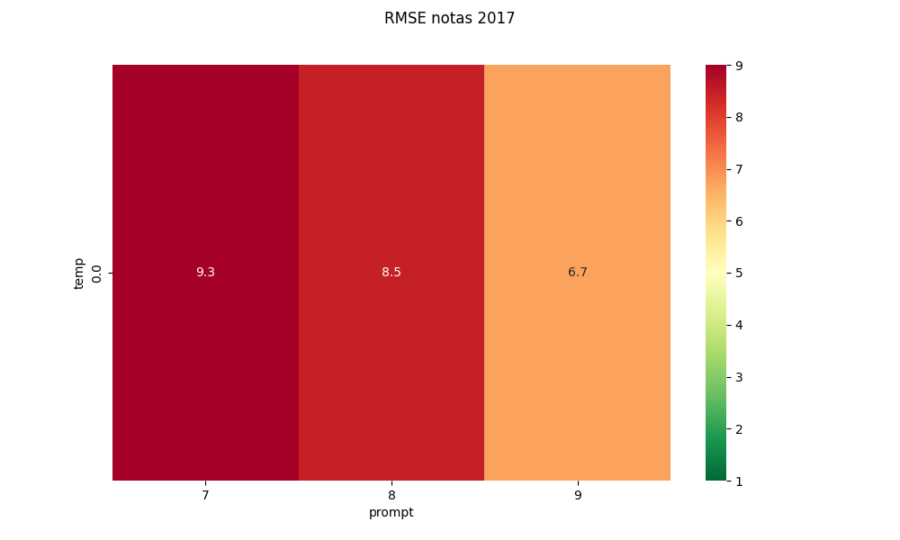
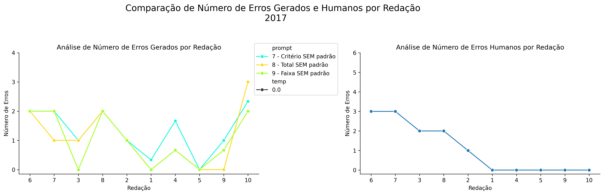
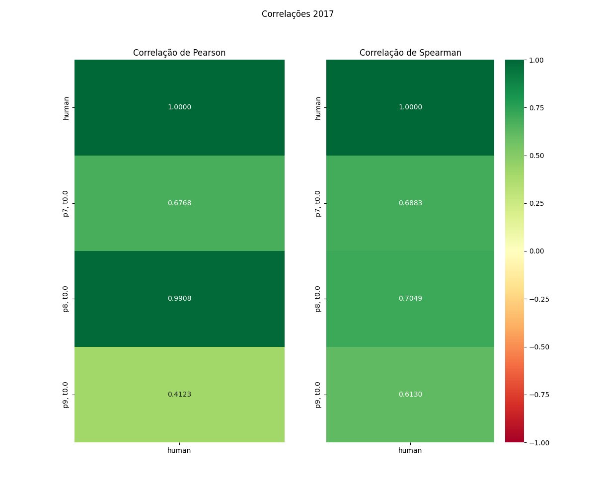

# Relatório de Avaliação: sabia-4 - 3 execuções
**Gerado em: 20/05/2026 13:28:55**

## 1. Distribuição de Notas
Nesta seção comparamos as notas atribuídas pelo modelo sabia-4 em diferentes prompts/temperaturas versus a correção humana.

## 2. Comparação de Notas Geradas e Humanas
Nesta seção, apresentamos a comparação entre as notas finais geradas pelo modelo e as notas dadas por avaliadores humanos.

## 3. Análise de Erro Absoluto de Validação

<table>
  <tr>
    <td>
      
    </td>
    <td>
      <table border="1" class="dataframe">
  <thead>
    <tr style="text-align: center;">
      <th>prompt</th>
      <th>temp</th>
      <th>area_sob_curva</th>
      <th>mae</th>
      <th>rmse</th>
    </tr>
  </thead>
  <tbody>
    <tr>
      <td>7</td>
      <td>0.0</td>
      <td>70.7000</td>
      <td>8.2233</td>
      <td>9.2862</td>
    </tr>
    <tr>
      <td>8</td>
      <td>0.0</td>
      <td>67.2834</td>
      <td>7.7567</td>
      <td>8.4671</td>
    </tr>
    <tr>
      <td>9</td>
      <td>0.0</td>
      <td>35.9500</td>
      <td>4.5900</td>
      <td>6.7417</td>
    </tr>
  </tbody>
</table>
    </td>
  </tr>
</table>

## 4. Análise de RMSE por Prompt e Temperatura
Nesta seção, apresentamos o heatmap de RMSE calculado por combinação de prompt e temperatura.

## 5. Análise de Erros Gramaticais
Comparação da sensibilidade do modelo na detecção/geração de erros em relação ao padrão humano.

## 6. Correlações

## Estatísticas Descritivas
### Modelo sabia-4
|       |    prompt |   temp |   redacao |   nota_final |   nota_final_std |       1A |        1B |        1C |      CGPL |   num_errors |
|:------|----------:|-------:|----------:|-------------:|-----------------:|---------:|----------:|----------:|----------:|-------------:|
| count | 30        |     30 |  30       |     30       |        30        | 10       | 10        | 10        | 10        |     30       |
| mean  |  8        |      0 |   5.5     |     53.2667  |         0.141987 |  8.81667 |  8.65     |  8.5      | 28.6667   |      1.14445 |
| std   |  0.830455 |      0 |   2.92138 |      2.63072 |         0.389304 |  0.43355 |  0.529675 |  0.711468 |  0.785676 |      0.87836 |
| min   |  7        |      0 |   1       |     48.5     |         0        |  8       |  7.5      |  7.3333   | 27.6667   |      0       |
| 25%   |  7        |      0 |   3       |     50       |         0        |  9       |  8.5      |  8        | 28        |      0.41665 |
| 50%   |  8        |      0 |   5.5     |     54.5     |         0        |  9       |  9        |  9        | 28.6667   |      1       |
| 75%   |  9        |      0 |   8       |     55       |         0        |  9       |  9        |  9        | 29        |      2       |
| max   |  9        |      0 |  10       |     57.1667  |         1.5275   |  9.1667  |  9        |  9.1667   | 30        |      3       |

### Humano
|       |   redacao |   nota_final |   num_errors |
|:------|----------:|-------------:|-------------:|
| count |  10       |      10      |     10       |
| mean  |   5.5     |      46.41   |      1.1     |
| std   |   3.02765 |       5.707  |      1.28668 |
| min   |   1       |      31.35   |      0       |
| 25%   |   3.25    |      46.8125 |      0       |
| 50%   |   5.5     |      47.25   |      0.5     |
| 75%   |   7.75    |      47.875  |      2       |
| max   |  10       |      53.75   |      3       |
