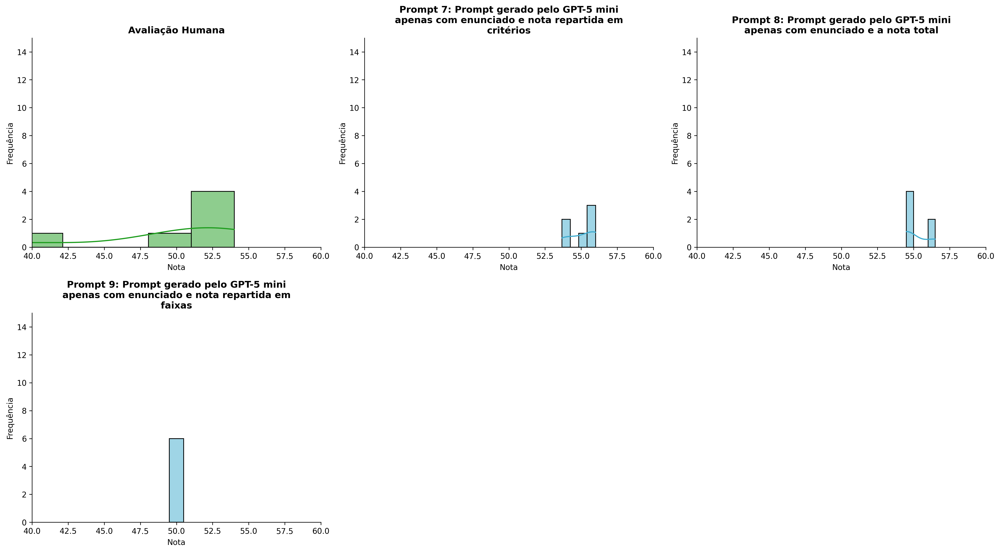
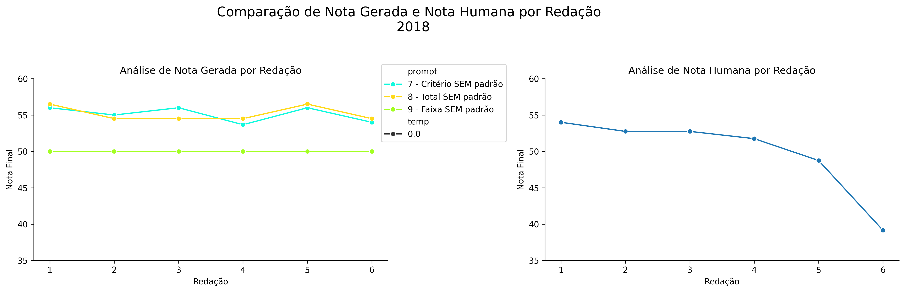
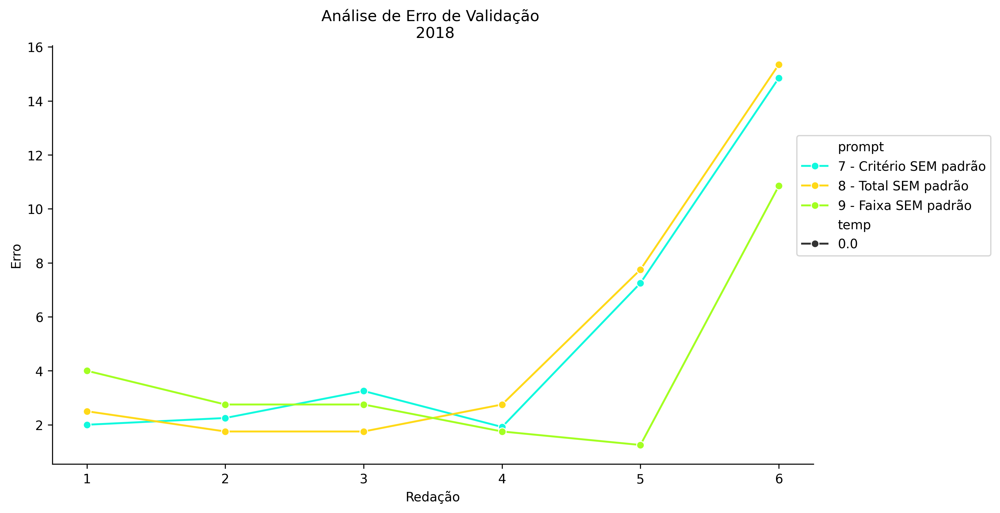
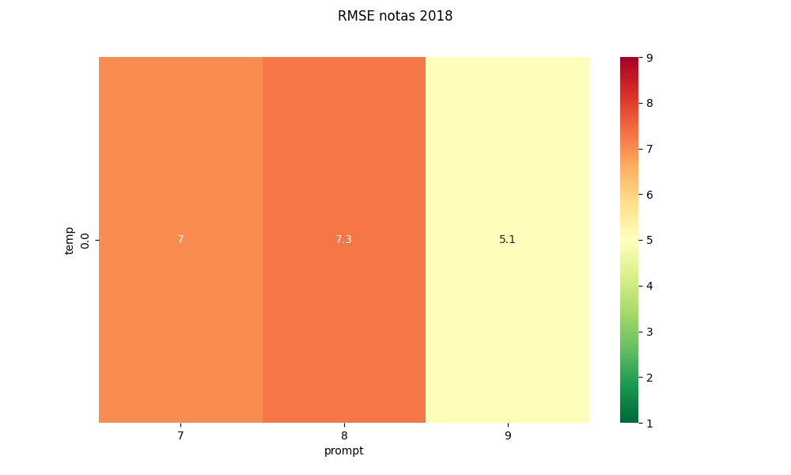
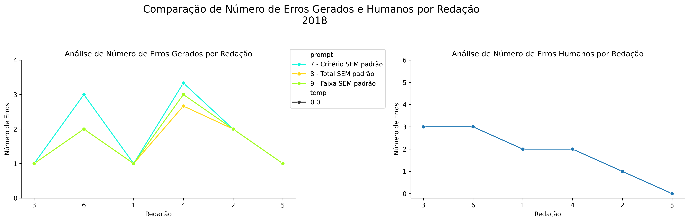
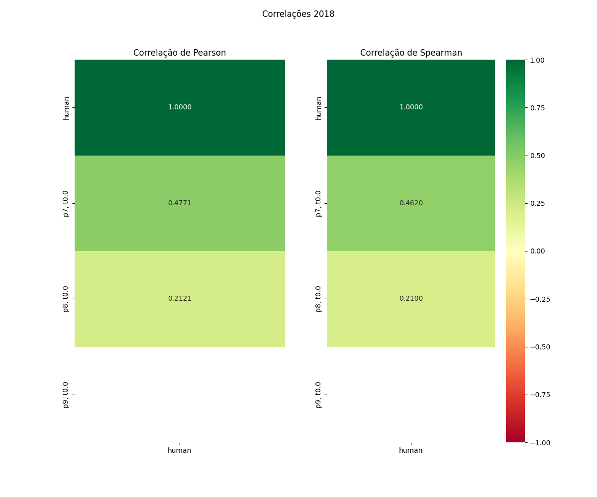

# Relatório de Avaliação: sabia-4 - 3 execuções
**Gerado em: 20/05/2026 13:28:58**

## 1. Distribuição de Notas
Nesta seção comparamos as notas atribuídas pelo modelo sabia-4 em diferentes prompts/temperaturas versus a correção humana.

## 2. Comparação de Notas Geradas e Humanas
Nesta seção, apresentamos a comparação entre as notas finais geradas pelo modelo e as notas dadas por avaliadores humanos.

## 3. Análise de Erro Absoluto de Validação

<table>
  <tr>
    <td>
      
    </td>
    <td>
      <table border="1" class="dataframe">
  <thead>
    <tr style="text-align: center;">
      <th>prompt</th>
      <th>temp</th>
      <th>area_sob_curva</th>
      <th>mae</th>
      <th>rmse</th>
    </tr>
  </thead>
  <tbody>
    <tr>
      <td>7</td>
      <td>0.0</td>
      <td>23.0917</td>
      <td>5.2528</td>
      <td>7.0283</td>
    </tr>
    <tr>
      <td>8</td>
      <td>0.0</td>
      <td>22.9250</td>
      <td>5.3083</td>
      <td>7.2528</td>
    </tr>
    <tr>
      <td>9</td>
      <td>0.0</td>
      <td>15.9250</td>
      <td>3.8917</td>
      <td>5.0575</td>
    </tr>
  </tbody>
</table>
    </td>
  </tr>
</table>

## 4. Análise de RMSE por Prompt e Temperatura
Nesta seção, apresentamos o heatmap de RMSE calculado por combinação de prompt e temperatura.

## 5. Análise de Erros Gramaticais
Comparação da sensibilidade do modelo na detecção/geração de erros em relação ao padrão humano.

## 6. Correlações

## Estatísticas Descritivas
### Modelo sabia-4
|       |    prompt |   temp |   redacao |   nota_final |   nota_final_std |   1A |   1B |   1C |     CGPL |   num_errors |
|:------|----------:|-------:|----------:|-------------:|-----------------:|-----:|-----:|-----:|---------:|-------------:|
| count | 18        |     18 |  18       |     18       |       18         |    6 |    6 |    6 |  6       |    18        |
| mean  |  8        |      0 |   3.5     |     53.4259  |        0.0320778 |    9 |    9 |    9 | 28.1111  |     1.72222  |
| std   |  0.840168 |      0 |   1.75734 |      2.61982 |        0.136094  |    0 |    0 |    0 |  1.06805 |     0.834312 |
| min   |  7        |      0 |   1       |     50       |        0         |    9 |    9 |    9 | 26.6667  |     1        |
| 25%   |  7        |      0 |   2       |     50       |        0         |    9 |    9 |    9 | 27.25    |     1        |
| 50%   |  8        |      0 |   3.5     |     54.5     |        0         |    9 |    9 |    9 | 28.5     |     1.5      |
| 75%   |  9        |      0 |   5       |     55.75    |        0         |    9 |    9 |    9 | 29       |     2        |
| max   |  9        |      0 |   6       |     56.5     |        0.5774    |    9 |    9 |    9 | 29       |     3.3333   |

### Humano
|       |   redacao |   nota_final |   num_errors |
|:------|----------:|-------------:|-------------:|
| count |   6       |      6       |      6       |
| mean  |   3.5     |     49.8583  |      1.83333 |
| std   |   1.87083 |      5.53809 |      1.16905 |
| min   |   1       |     39.15    |      0       |
| 25%   |   2.25    |     49.5     |      1.25    |
| 50%   |   3.5     |     52.25    |      2       |
| 75%   |   4.75    |     52.75    |      2.75    |
| max   |   6       |     54       |      3       |
