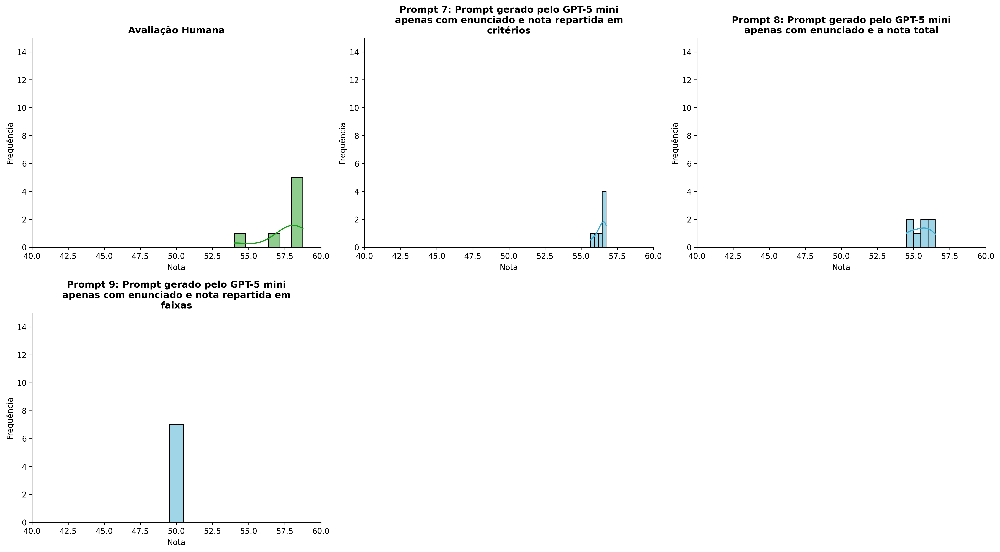
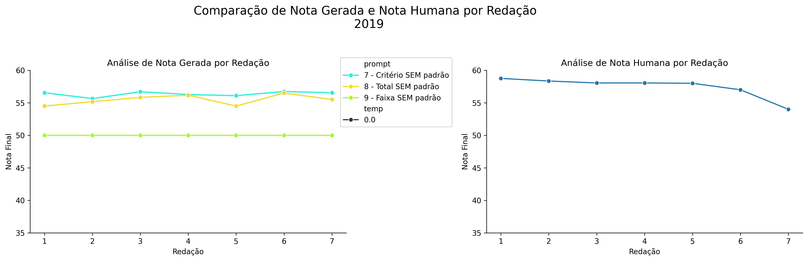
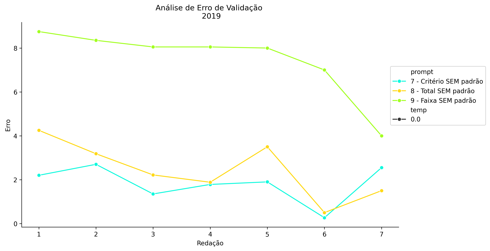
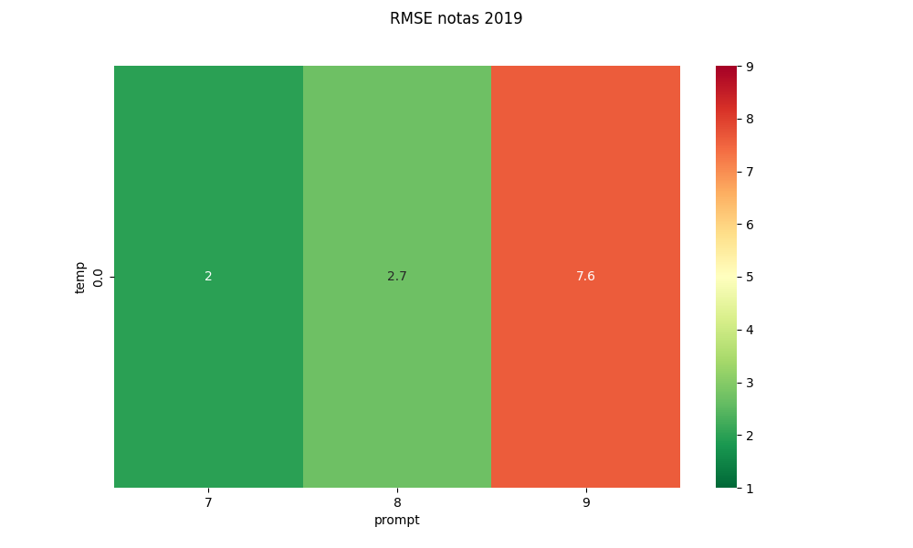
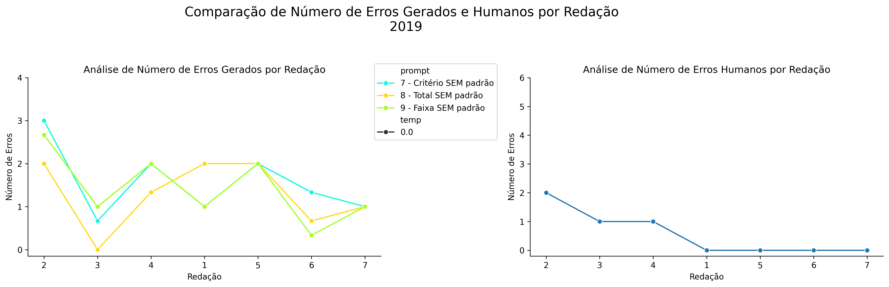
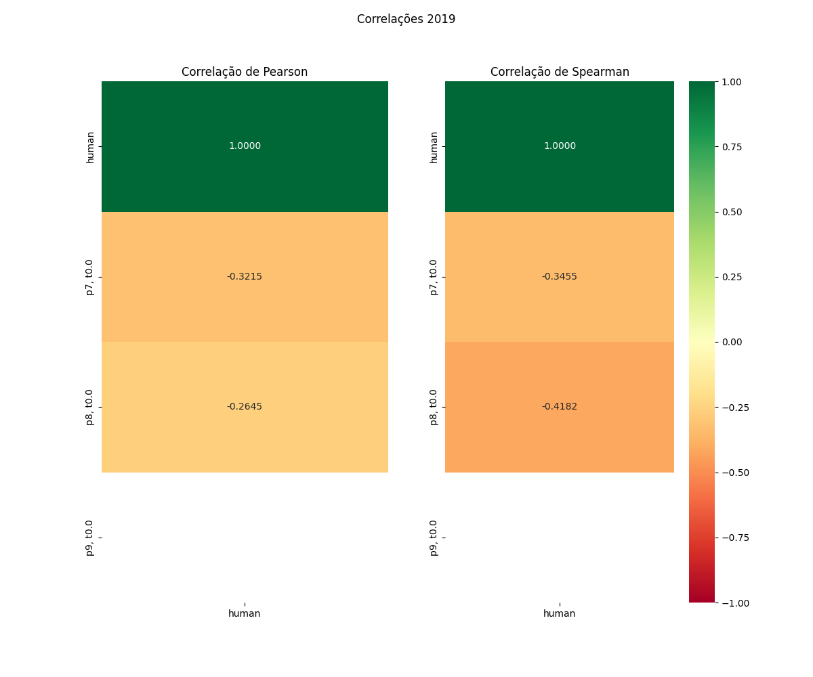

# Relatório de Avaliação: sabia-4 - 3 execuções
**Gerado em: 20/05/2026 13:29:02**

## 1. Distribuição de Notas
Nesta seção comparamos as notas atribuídas pelo modelo sabia-4 em diferentes prompts/temperaturas versus a correção humana.

## 2. Comparação de Notas Geradas e Humanas
Nesta seção, apresentamos a comparação entre as notas finais geradas pelo modelo e as notas dadas por avaliadores humanos.

## 3. Análise de Erro Absoluto de Validação

<table>
  <tr>
    <td>
      
    </td>
    <td>
      <table border="1" class="dataframe">
  <thead>
    <tr style="text-align: center;">
      <th>prompt</th>
      <th>temp</th>
      <th>area_sob_curva</th>
      <th>mae</th>
      <th>rmse</th>
    </tr>
  </thead>
  <tbody>
    <tr>
      <td>7</td>
      <td>0.0</td>
      <td>10.3750</td>
      <td>1.8214</td>
      <td>1.9754</td>
    </tr>
    <tr>
      <td>8</td>
      <td>0.0</td>
      <td>14.1583</td>
      <td>2.4333</td>
      <td>2.7099</td>
    </tr>
    <tr>
      <td>9</td>
      <td>0.0</td>
      <td>45.8250</td>
      <td>7.4571</td>
      <td>7.6054</td>
    </tr>
  </tbody>
</table>
    </td>
  </tr>
</table>

## 4. Análise de RMSE por Prompt e Temperatura
Nesta seção, apresentamos o heatmap de RMSE calculado por combinação de prompt e temperatura.

## 5. Análise de Erros Gramaticais
Comparação da sensibilidade do modelo na detecção/geração de erros em relação ao padrão humano.

## 6. Correlações

## Estatísticas Descritivas
### Modelo sabia-4
|       |   prompt |   temp |   redacao |   nota_final |   nota_final_std |       1A |        1B |   1C |      CGPL |   num_errors |
|:------|---------:|-------:|----------:|-------------:|-----------------:|---------:|----------:|-----:|----------:|-------------:|
| count | 21       |     21 |  21       |     21       |        21        | 7        | 7         |    7 |  7        |    21        |
| mean  |  8       |      0 |   4       |     53.9389  |         0.386905 | 9.04761  | 9.02381   |    9 | 29.2929   |     1.42857  |
| std   |  0.83666 |      0 |   2.04939 |      2.91869 |         0.635742 | 0.125976 | 0.0630067 |    0 |  0.364496 |     0.768427 |
| min   |  7       |      0 |   1       |     50       |         0        | 9        | 9         |    9 | 28.65     |     0        |
| 25%   |  7       |      0 |   2       |     50       |         0        | 9        | 9         |    9 | 29.1      |     1        |
| 50%   |  8       |      0 |   4       |     55.5     |         0        | 9        | 9         |    9 | 29.4      |     1.3333   |
| 75%   |  9       |      0 |   6       |     56.2667  |         0.2887   | 9        | 9         |    9 | 29.55     |     2        |
| max   |  9       |      0 |   7       |     56.7333  |         1.7321   | 9.3333   | 9.1667    |    9 | 29.7      |     3        |

### Humano
|       |   redacao |   nota_final |   num_errors |
|:------|----------:|-------------:|-------------:|
| count |   7       |      7       |     7        |
| mean  |   4       |     57.4571  |     0.571429 |
| std   |   2.16025 |      1.61385 |     0.786796 |
| min   |   1       |     54       |     0        |
| 25%   |   2.5     |     57.5     |     0        |
| 50%   |   4       |     58.05    |     0        |
| 75%   |   5.5     |     58.2     |     1        |
| max   |   7       |     58.75    |     2        |
