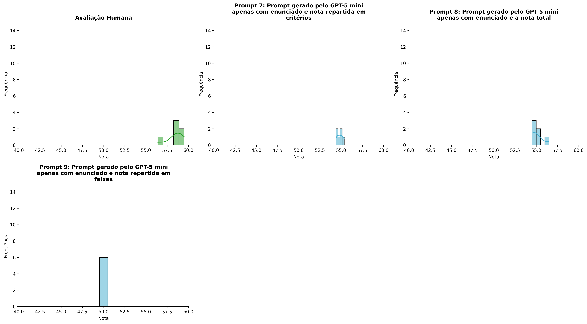
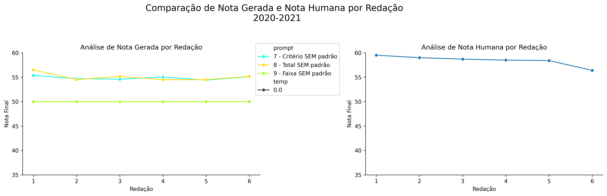
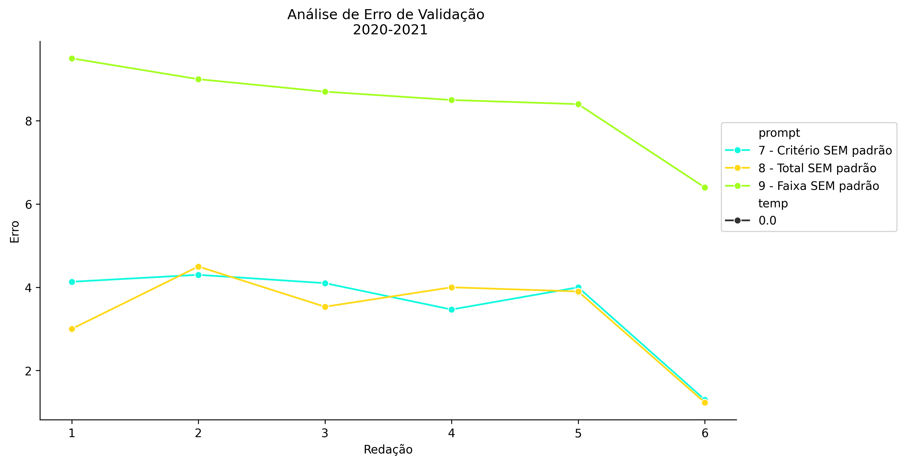
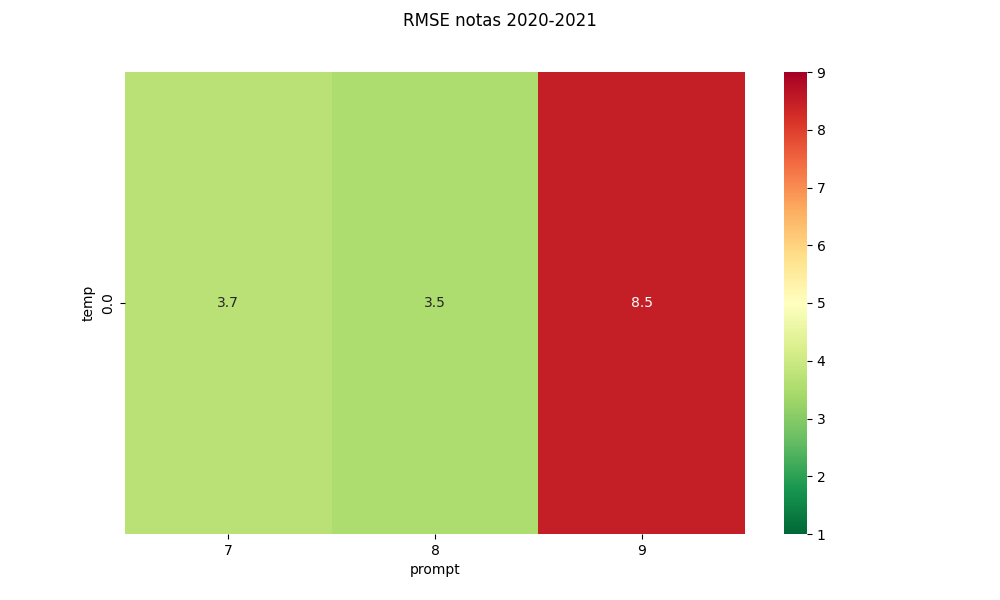
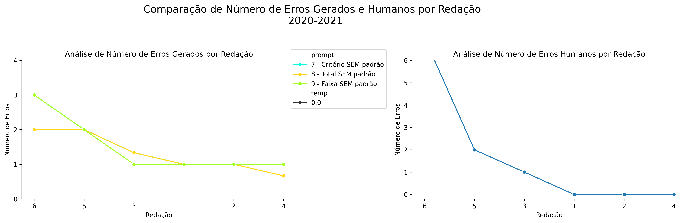
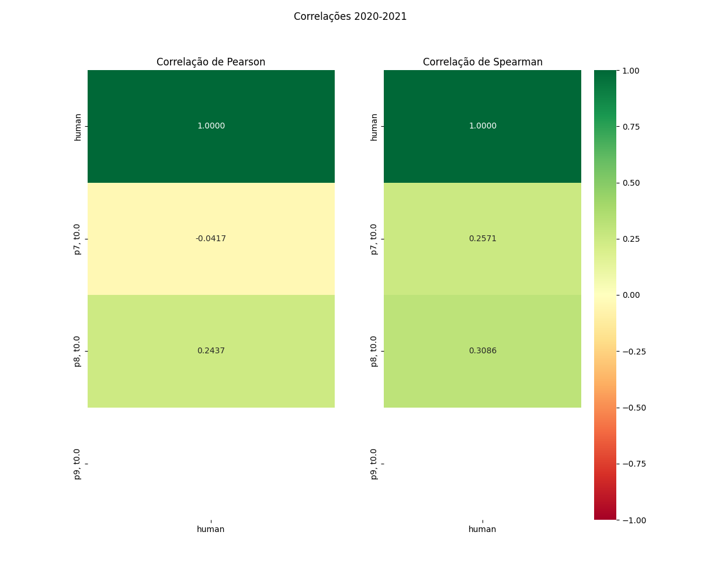

# Relatório de Avaliação: sabia-4 - 3 execuções
**Gerado em: 20/05/2026 13:29:05**

## 1. Distribuição de Notas
Nesta seção comparamos as notas atribuídas pelo modelo sabia-4 em diferentes prompts/temperaturas versus a correção humana.

## 2. Comparação de Notas Geradas e Humanas
Nesta seção, apresentamos a comparação entre as notas finais geradas pelo modelo e as notas dadas por avaliadores humanos.

## 3. Análise de Erro Absoluto de Validação

<table>
  <tr>
    <td>
      
    </td>
    <td>
      <table border="1" class="dataframe">
  <thead>
    <tr style="text-align: center;">
      <th>prompt</th>
      <th>temp</th>
      <th>area_sob_curva</th>
      <th>mae</th>
      <th>rmse</th>
    </tr>
  </thead>
  <tbody>
    <tr>
      <td>7</td>
      <td>0.0</td>
      <td>18.5834</td>
      <td>3.5500</td>
      <td>3.6989</td>
    </tr>
    <tr>
      <td>8</td>
      <td>0.0</td>
      <td>18.0500</td>
      <td>3.3611</td>
      <td>3.5229</td>
    </tr>
    <tr>
      <td>9</td>
      <td>0.0</td>
      <td>42.5500</td>
      <td>8.4167</td>
      <td>8.4726</td>
    </tr>
  </tbody>
</table>
    </td>
  </tr>
</table>

## 4. Análise de RMSE por Prompt e Temperatura
Nesta seção, apresentamos o heatmap de RMSE calculado por combinação de prompt e temperatura.

## 5. Análise de Erros Gramaticais
Comparação da sensibilidade do modelo na detecção/geração de erros em relação ao padrão humano.

## 6. Correlações

## Estatísticas Descritivas
### Modelo sabia-4
|       |    prompt |   temp |   redacao |   nota_final |   nota_final_std |   1A |   1B |        1C |      CGPL |   num_errors |
|:------|----------:|-------:|----------:|-------------:|-----------------:|-----:|-----:|----------:|----------:|-------------:|
| count | 18        |     18 |  18       |     18       |        18        |    6 |    6 |  6        |  6        |    18        |
| mean  |  8        |      0 |   3.5     |     53.3074  |         0.202078 |    9 |    9 | 17.3333   | 19.5333   |     1.46296  |
| std   |  0.840168 |      0 |   1.75734 |      2.45241 |         0.393207 |    0 |    0 |  0.421642 |  0.242212 |     0.706078 |
| min   |  7        |      0 |   1       |     50       |         0        |    9 |    9 | 17        | 19.1      |     0.6667   |
| 25%   |  7        |      0 |   2       |     50       |         0        |    9 |    9 | 17        | 19.45     |     1        |
| 50%   |  8        |      0 |   3.5     |     54.5     |         0        |    9 |    9 | 17.1667   | 19.65     |     1        |
| 75%   |  9        |      0 |   5       |     55.0833  |         0.1299   |    9 |    9 | 17.5833   | 19.7      |     2        |
| max   |  9        |      0 |   6       |     56.5     |         1.1547   |    9 |    9 | 18        | 19.7      |     3        |

### Humano
|       |   redacao |   nota_final |   num_errors |
|:------|----------:|-------------:|-------------:|
| count |   6       |      6       |      6       |
| mean  |   3.5     |     58.4167  |      1.66667 |
| std   |   1.87083 |      1.06474 |      2.73252 |
| min   |   1       |     56.4     |      0       |
| 25%   |   2.25    |     58.425   |      0       |
| 50%   |   3.5     |     58.6     |      0.5     |
| 75%   |   4.75    |     58.925   |      1.75    |
| max   |   6       |     59.5     |      7       |
