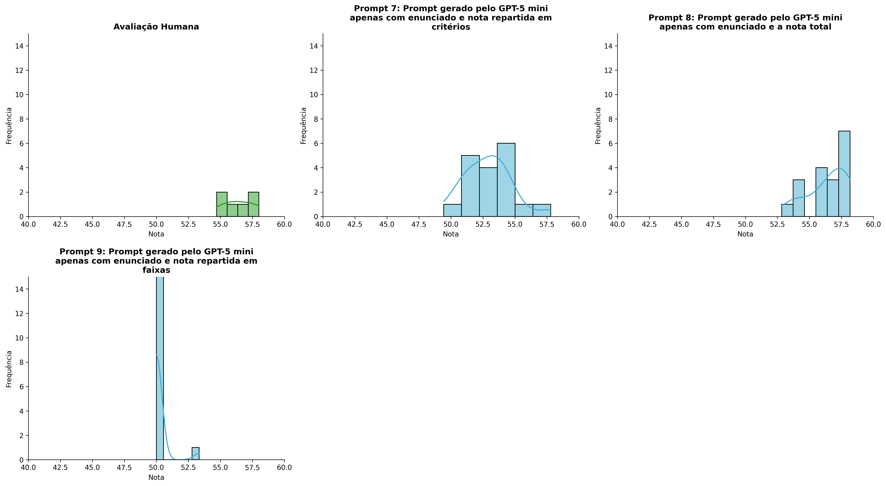
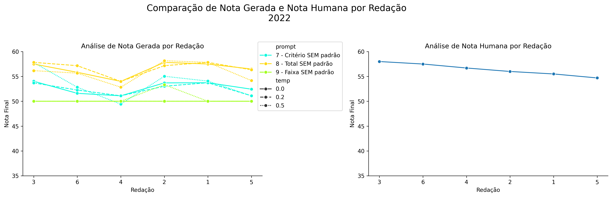
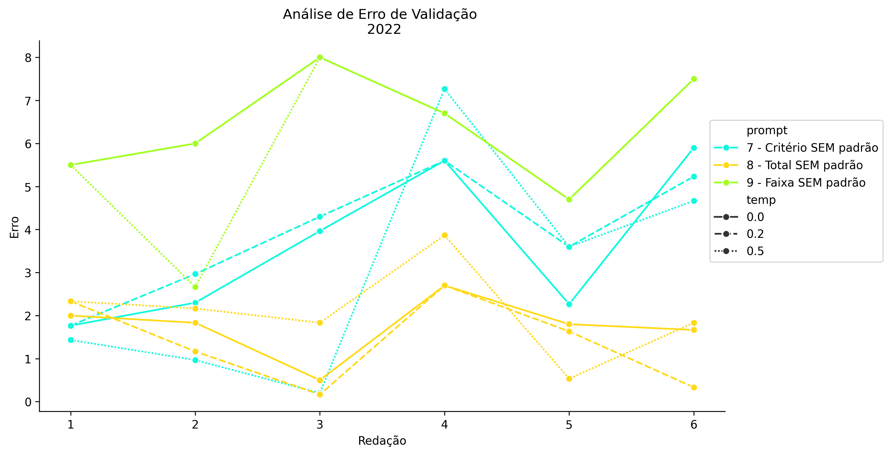
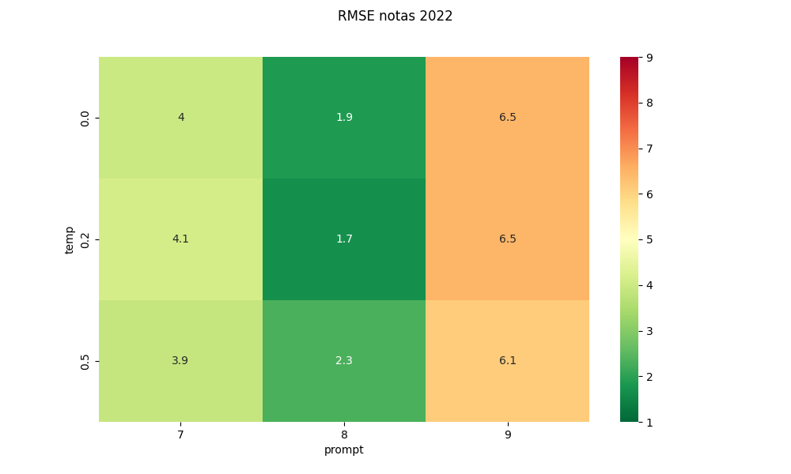
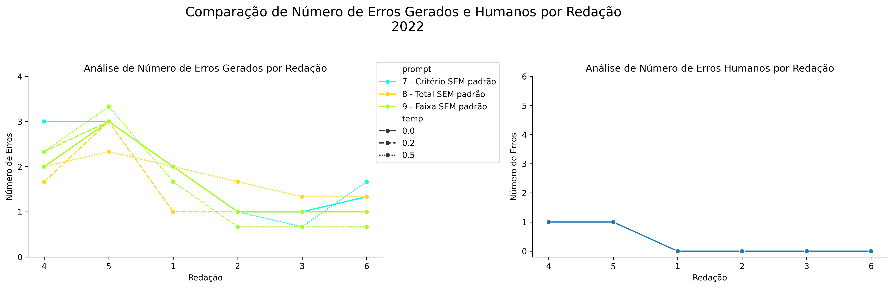
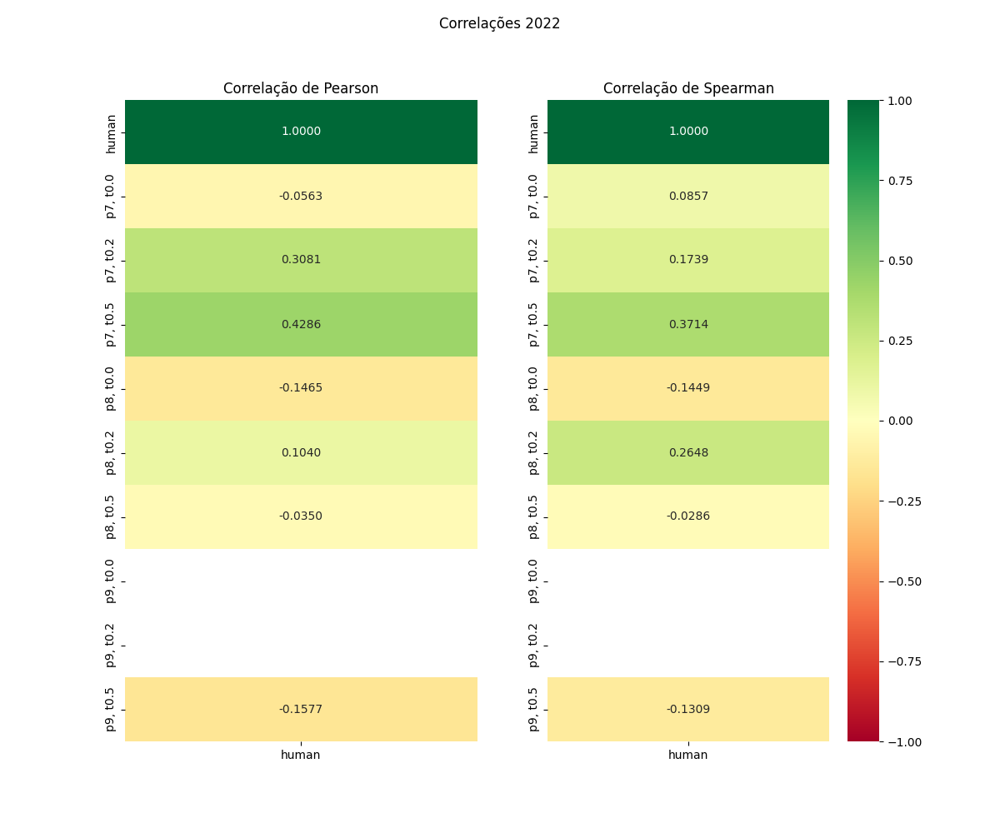

# Relatório de Avaliação: sabia-4 - 3 execuções
**Gerado em: 08/05/2026 01:38:44**

## 1. Distribuição de Notas
Nesta seção comparamos as notas atribuídas pelo modelo sabia em diferentes prompts/temperaturas versus a correção humana.

## 2. Comparação de Notas Geradas e Humanas
Nesta seção, apresentamos a comparação entre as notas finais geradas pelo modelo e as notas dadas por avaliadores humanos.

## 3. Análise de Erro Absoluto de Validação

<table>
  <tr>
    <td>
      
    </td>
    <td>
      <table border="1" class="dataframe">
  <thead>
    <tr style="text-align: center;">
      <th>prompt</th>
      <th>temp</th>
      <th>area_sob_curva</th>
      <th>mae</th>
      <th>rmse</th>
    </tr>
  </thead>
  <tbody>
    <tr>
      <td>7</td>
      <td>0.0</td>
      <td>17.9668</td>
      <td>3.6334</td>
      <td>3.9886</td>
    </tr>
    <tr>
      <td>7</td>
      <td>0.2</td>
      <td>19.9667</td>
      <td>3.9111</td>
      <td>4.1255</td>
    </tr>
    <tr>
      <td>7</td>
      <td>0.5</td>
      <td>15.0834</td>
      <td>3.0222</td>
      <td>3.8853</td>
    </tr>
    <tr>
      <td>8</td>
      <td>0.0</td>
      <td>8.6666</td>
      <td>1.7500</td>
      <td>1.8672</td>
    </tr>
    <tr>
      <td>8</td>
      <td>0.2</td>
      <td>7.0000</td>
      <td>1.3889</td>
      <td>1.6784</td>
    </tr>
    <tr>
      <td>8</td>
      <td>0.5</td>
      <td>10.4833</td>
      <td>2.0944</td>
      <td>2.3129</td>
    </tr>
    <tr>
      <td>9</td>
      <td>0.0</td>
      <td>31.9000</td>
      <td>6.4000</td>
      <td>6.4997</td>
    </tr>
    <tr>
      <td>9</td>
      <td>0.2</td>
      <td>31.9000</td>
      <td>6.4000</td>
      <td>6.4997</td>
    </tr>
    <tr>
      <td>9</td>
      <td>0.5</td>
      <td>28.5667</td>
      <td>5.8445</td>
      <td>6.1182</td>
    </tr>
  </tbody>
</table>
    </td>
  </tr>
</table>

## 4. Análise de RMSE por Prompt e Temperatura
Nesta seção, apresentamos o heatmap de RMSE calculado por combinação de prompt e temperatura.

## 5. Análise de Erros Gramaticais
Comparação da sensibilidade do modelo na detecção/geração de erros em relação ao padrão humano.

## 6. Correlações

## Estatísticas Descritivas
### Modelo sabia-4
|       |    prompt |      temp |   redacao |   nota_final |   nota_final_std |        1A |        1B |        1C |      CGPL |   num_errors |
|:------|----------:|----------:|----------:|-------------:|-----------------:|----------:|----------:|----------:|----------:|-------------:|
| count | 54        | 54        |  54       |     54       |        54        | 18        | 18        | 18        | 18        |     54       |
| mean  |  8        |  0.233333 |   3.5     |     53.1383  |         0.522015 |  9.05556  |  9.12963  | 17.6296   | 17.063    |      1.72222 |
| std   |  0.824163 |  0.20741  |   1.72386 |      2.94862 |         0.779155 |  0.235709 |  0.326187 |  0.635427 |  0.842328 |      0.81585 |
| min   |  7        |  0        |   1       |     49.4333  |         0        |  8.6667   |  8.3333   | 16.6667   | 15.7667   |      0.6667  |
| 25%   |  7        |  0        |   2       |     50       |         0        |  9        |  9        | 17        | 16.225    |      1       |
| 50%   |  8        |  0.2      |   3.5     |     52.9333  |         0        |  9        |  9        | 17.6667   | 17.2667   |      1.6667  |
| 75%   |  9        |  0.5      |   5       |     55.7917  |         0.94325  |  9        |  9.3333   | 18        | 17.625    |      2.24998 |
| max   |  9        |  0.5      |   6       |     58.1667  |         3.8105   |  9.6667   |  9.6667   | 19.3333   | 19.1333   |      3.3333  |

### Humano
|       |   redacao |   nota_final |        1A |        1B |        1C |      CGPL |   num_errors |
|:------|----------:|-------------:|----------:|----------:|----------:|----------:|-------------:|
| count |   6       |      6       |  6        |  6        |  6        |  6        |     6        |
| mean  |   3.5     |     56.4     |  9.75     |  9.75     | 18.5      | 18.4      |     0.333333 |
| std   |   1.87083 |      1.24258 |  0.273861 |  0.273861 |  0.447214 |  0.532917 |     0.516398 |
| min   |   1       |     54.7     |  9.5      |  9.5      | 18        | 17.7      |     0        |
| 25%   |   2.25    |     55.625   |  9.5      |  9.5      | 18.125    | 18.05     |     0        |
| 50%   |   3.5     |     56.35    |  9.75     |  9.75     | 18.5      | 18.35     |     0        |
| 75%   |   4.75    |     57.3     | 10        | 10        | 18.875    | 18.875    |     0.75     |
| max   |   6       |     58       | 10        | 10        | 19        | 19        |     1        |
