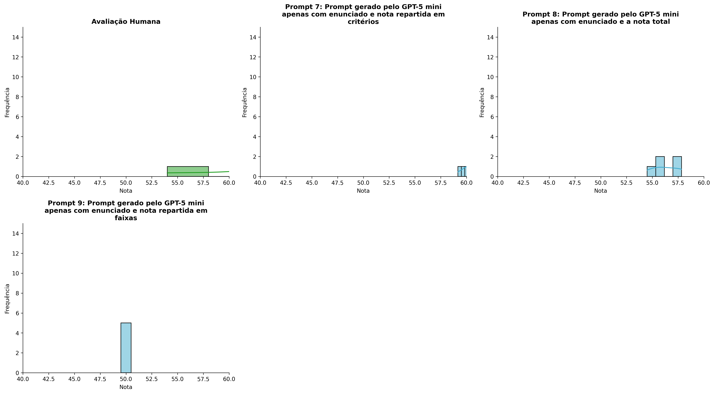
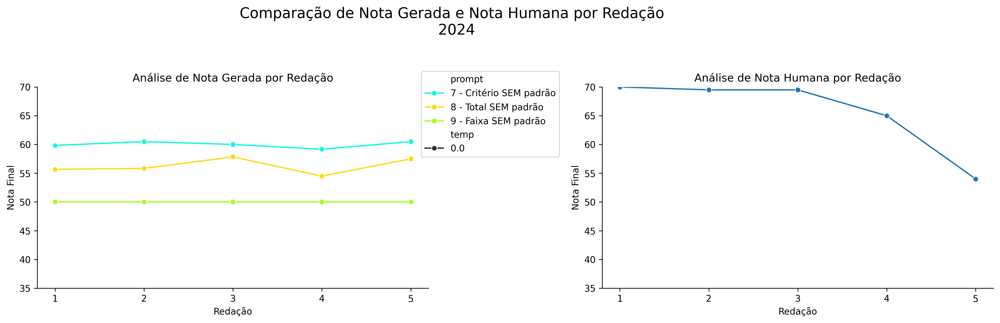
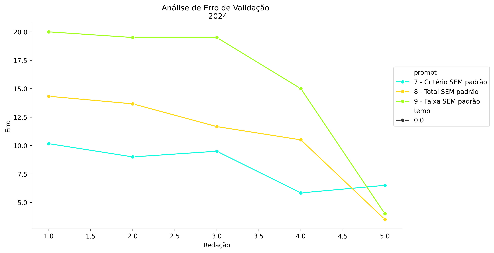
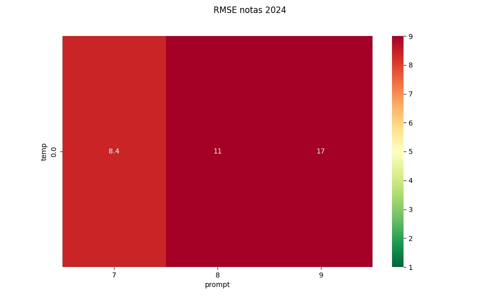
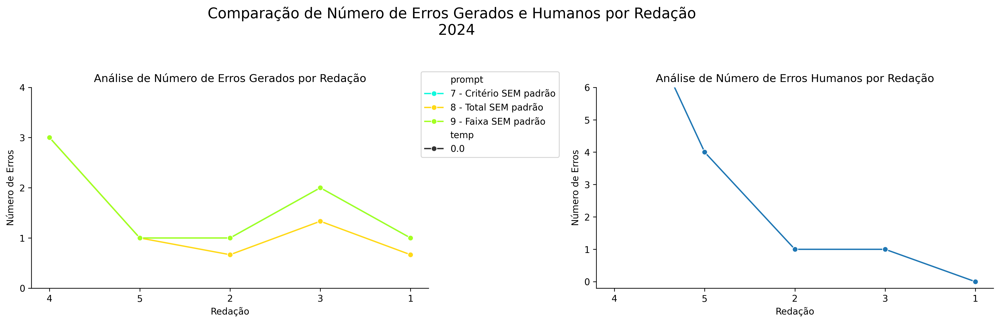
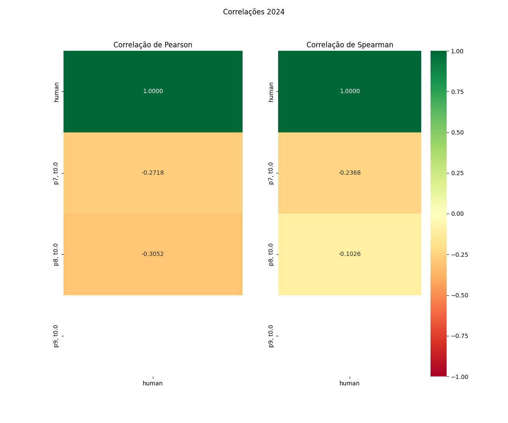

# Relatório de Avaliação: sabia-4 - 3 execuções
**Gerado em: 20/05/2026 13:29:16**

## 1. Distribuição de Notas
Nesta seção comparamos as notas atribuídas pelo modelo sabia-4 em diferentes prompts/temperaturas versus a correção humana.

## 2. Comparação de Notas Geradas e Humanas
Nesta seção, apresentamos a comparação entre as notas finais geradas pelo modelo e as notas dadas por avaliadores humanos.

## 3. Análise de Erro Absoluto de Validação

<table>
  <tr>
    <td>
      
    </td>
    <td>
      <table border="1" class="dataframe">
  <thead>
    <tr style="text-align: center;">
      <th>prompt</th>
      <th>temp</th>
      <th>area_sob_curva</th>
      <th>mae</th>
      <th>rmse</th>
    </tr>
  </thead>
  <tbody>
    <tr>
      <td>7</td>
      <td>0.0</td>
      <td>32.6667</td>
      <td>8.2000</td>
      <td>8.3772</td>
    </tr>
    <tr>
      <td>8</td>
      <td>0.0</td>
      <td>44.7500</td>
      <td>10.7333</td>
      <td>11.4091</td>
    </tr>
    <tr>
      <td>9</td>
      <td>0.0</td>
      <td>66.0000</td>
      <td>15.6000</td>
      <td>16.7422</td>
    </tr>
  </tbody>
</table>
    </td>
  </tr>
</table>

## 4. Análise de RMSE por Prompt e Temperatura
Nesta seção, apresentamos o heatmap de RMSE calculado por combinação de prompt e temperatura.

## 5. Análise de Erros Gramaticais
Comparação da sensibilidade do modelo na detecção/geração de erros em relação ao padrão humano.

## 6. Correlações

## Estatísticas Descritivas
### Modelo sabia-4
|       |    prompt |   temp |   redacao |   nota_final |   nota_final_std |   1A |   1B |        1C |      CGPL |   num_errors |
|:------|----------:|-------:|----------:|-------------:|-----------------:|-----:|-----:|----------:|----------:|-------------:|
| count | 15        |     15 |  15       |     15       |        15        |    5 |    5 |  5        |  5        |    15        |
| mean  |  8        |      0 |   3       |     55.4222  |         0.288687 |    9 |    9 | 17.8      | 24.2      |     1.51111  |
| std   |  0.845154 |      0 |   1.46385 |      4.34425 |         0.475605 |    0 |    0 |  0.298152 |  0.447214 |     0.862501 |
| min   |  7        |      0 |   1       |     50       |         0        |    9 |    9 | 17.3333   | 23.5      |     0.6667   |
| 25%   |  7        |      0 |   2       |     50       |         0        |    9 |    9 | 17.6667   | 24        |     1        |
| 50%   |  8        |      0 |   3       |     55.8333  |         0        |    9 |    9 | 18        | 24.5      |     1        |
| 75%   |  9        |      0 |   4       |     59.5     |         0.5774   |    9 |    9 | 18        | 24.5      |     2        |
| max   |  9        |      0 |   5       |     60.5     |         1.4434   |    9 |    9 | 18        | 24.5      |     3        |

### Humano
|       |   redacao |   nota_final |   num_errors |
|:------|----------:|-------------:|-------------:|
| count |   5       |      5       |      5       |
| mean  |   3       |     65.6     |      3.2     |
| std   |   1.58114 |      6.79522 |      4.08656 |
| min   |   1       |     54       |      0       |
| 25%   |   2       |     65       |      1       |
| 50%   |   3       |     69.5     |      1       |
| 75%   |   4       |     69.5     |      4       |
| max   |   5       |     70       |     10       |
