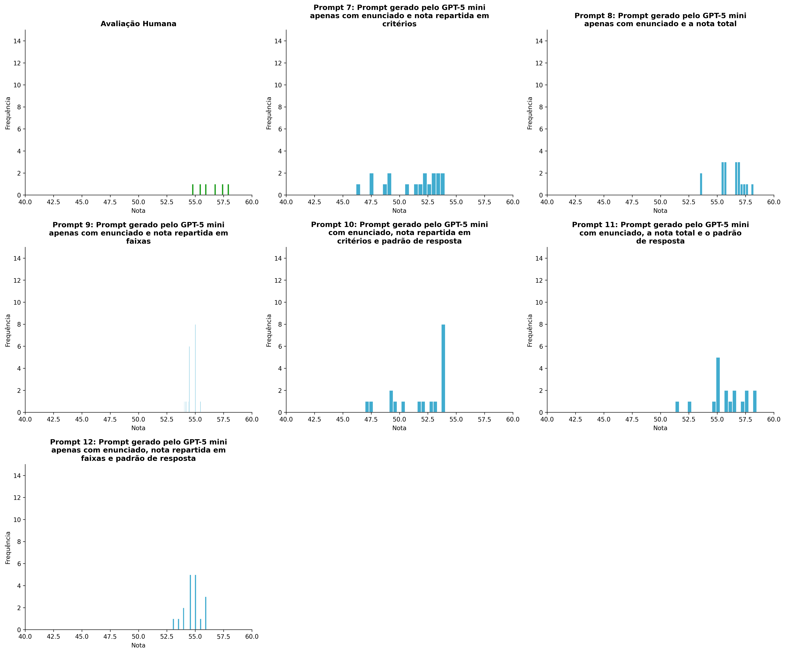
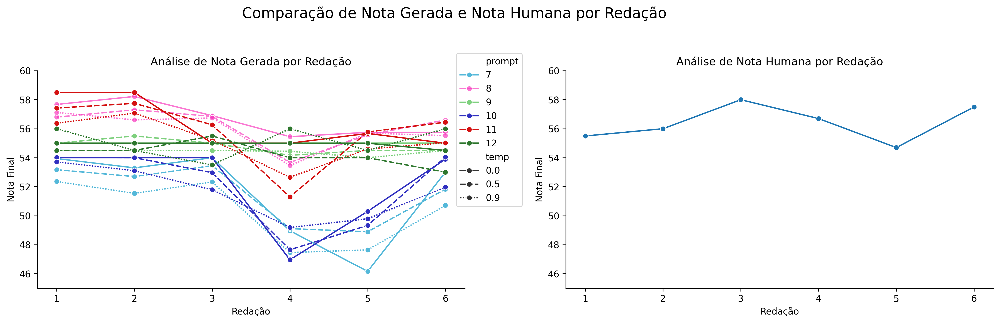
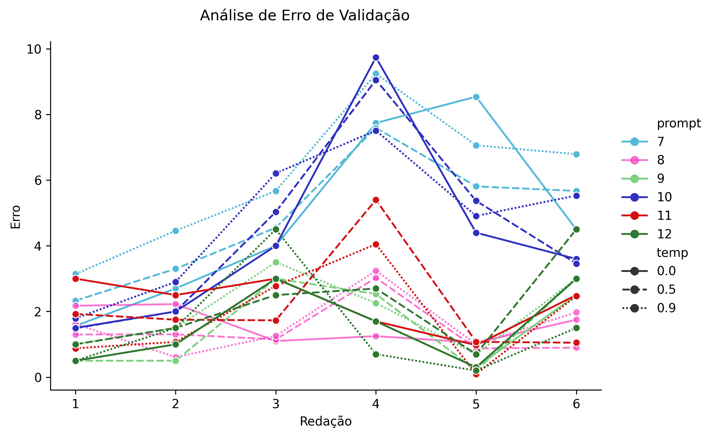

# Relatório de Avaliação: sabia v3.1 - 10 execuções
**Gerado em: 18/01/2026 17:34:04**

## 1. Distribuição de Notas
Nesta seção comparamos as notas atribuídas pelo modelo sabia em diferentes prompts/temperaturas versus a correção humana.

## 2. Comparação de Notas Geradas e Humanas
Nesta seção, apresentamos a comparação entre as notas finais geradas pelo modelo e as notas dadas por avaliadores humanos.

## 3. Análise de Erro Absoluto de Validação

<table>
  <tr>
    <td>
      
    </td>
    <td>
      <table border="1" class="dataframe">
  <thead>
    <tr style="text-align: right;">
      <th></th>
      <th>prompt</th>
      <th>temp</th>
      <th>area_sob_curva</th>
      <th>mae</th>
      <th>rmse</th>
    </tr>
  </thead>
  <tbody>
    <tr>
      <th>0</th>
      <td>7</td>
      <td>0.0</td>
      <td>26.0100</td>
      <td>4.8400</td>
      <td>5.4591</td>
    </tr>
    <tr>
      <th>1</th>
      <td>7</td>
      <td>0.5</td>
      <td>25.2500</td>
      <td>4.8750</td>
      <td>5.1726</td>
    </tr>
    <tr>
      <th>2</th>
      <td>7</td>
      <td>0.9</td>
      <td>31.3950</td>
      <td>6.0600</td>
      <td>6.3669</td>
    </tr>
    <tr>
      <th>3</th>
      <td>8</td>
      <td>0.0</td>
      <td>7.5875</td>
      <td>1.5917</td>
      <td>1.6643</td>
    </tr>
    <tr>
      <th>4</th>
      <td>8</td>
      <td>0.5</td>
      <td>7.4550</td>
      <td>1.4258</td>
      <td>1.6043</td>
    </tr>
    <tr>
      <th>5</th>
      <td>8</td>
      <td>0.9</td>
      <td>7.9095</td>
      <td>1.6178</td>
      <td>1.8255</td>
    </tr>
    <tr>
      <th>6</th>
      <td>9</td>
      <td>0.0</td>
      <td>7.5000</td>
      <td>1.5000</td>
      <td>1.8019</td>
    </tr>
    <tr>
      <th>7</th>
      <td>9</td>
      <td>0.5</td>
      <td>7.9833</td>
      <td>1.6222</td>
      <td>2.0395</td>
    </tr>
    <tr>
      <th>8</th>
      <td>9</td>
      <td>0.9</td>
      <td>9.9556</td>
      <td>1.9926</td>
      <td>2.2390</td>
    </tr>
    <tr>
      <th>9</th>
      <td>10</td>
      <td>0.0</td>
      <td>22.6900</td>
      <td>4.2067</td>
      <td>4.9906</td>
    </tr>
    <tr>
      <th>10</th>
      <td>10</td>
      <td>0.5</td>
      <td>23.9250</td>
      <td>4.4000</td>
      <td>5.0700</td>
    </tr>
    <tr>
      <th>11</th>
      <td>10</td>
      <td>0.9</td>
      <td>25.1900</td>
      <td>4.8083</td>
      <td>5.1844</td>
    </tr>
    <tr>
      <th>12</th>
      <td>11</td>
      <td>0.0</td>
      <td>10.9250</td>
      <td>2.2792</td>
      <td>2.3924</td>
    </tr>
    <tr>
      <th>13</th>
      <td>11</td>
      <td>0.5</td>
      <td>11.4425</td>
      <td>2.1550</td>
      <td>2.6198</td>
    </tr>
    <tr>
      <th>14</th>
      <td>11</td>
      <td>0.9</td>
      <td>9.6730</td>
      <td>1.8915</td>
      <td>2.3154</td>
    </tr>
    <tr>
      <th>15</th>
      <td>12</td>
      <td>0.0</td>
      <td>7.7500</td>
      <td>1.5833</td>
      <td>1.9248</td>
    </tr>
    <tr>
      <th>16</th>
      <td>12</td>
      <td>0.5</td>
      <td>10.1500</td>
      <td>2.1500</td>
      <td>2.5010</td>
    </tr>
    <tr>
      <th>17</th>
      <td>12</td>
      <td>0.9</td>
      <td>7.9000</td>
      <td>1.4833</td>
      <td>2.0628</td>
    </tr>
  </tbody>
</table>
    </td>
  </tr>
</table>

## 4. Análise de Erros Gramaticais
Comparação da sensibilidade do modelo na detecção/geração de erros em relação ao padrão humano.

## 4. Estatísticas Descritivas
### Modelo sabia v3.1
|       |    prompt |       temp |   redacao |   nota_final |        1A |        1B |       1C |     CGPL |   num_errors |
|:------|----------:|-----------:|----------:|-------------:|----------:|----------:|---------:|---------:|-------------:|
| count | 108       | 108        | 108       |    108       | 36        | 36        | 36       | 36       |   108        |
| mean  |   9.5     |   0.466667 |   3.5     |     54.085   |  8.69444  |  8.7375   | 17.2611  | 16.8419  |     0.862037 |
| std   |   1.71579 |   0.369895 |   1.71579 |      2.53729 |  0.338437 |  0.282937 |  0.88035 |  1.19975 |     1.02954  |
| min   |   7       |   0        |   1       |     46.16    |  8        |  8        | 15       | 14.16    |     0        |
| 25%   |   8       |   0        |   2       |     53.2675  |  8.5      |  8.5375   | 16.575   | 15.72    |     0        |
| 50%   |   9.5     |   0.5      |   3.5     |     54.5     |  8.8      |  8.8      | 17.675   | 17.23    |     0.4      |
| 75%   |  11       |   0.9      |   5       |     55.5375  |  9        |  9        | 18       | 17.9525  |     1.325    |
| max   |  12       |   0.9      |   6       |     58.5     |  9.15     |  9.1      | 18.1     | 18.1     |     3.7      |

### Humano
|       |   redacao |   nota_final |        1A |        1B |        1C |      CGPL |   num_errors |
|:------|----------:|-------------:|----------:|----------:|----------:|----------:|-------------:|
| count |   6       |      6       |  6        |  6        |  6        |  6        |     6        |
| mean  |   3.5     |     56.4     |  9.75     |  9.75     | 18.5      | 18.4      |     0.333333 |
| std   |   1.87083 |      1.24258 |  0.273861 |  0.273861 |  0.447214 |  0.532917 |     0.516398 |
| min   |   1       |     54.7     |  9.5      |  9.5      | 18        | 17.7      |     0        |
| 25%   |   2.25    |     55.625   |  9.5      |  9.5      | 18.125    | 18.05     |     0        |
| 50%   |   3.5     |     56.35    |  9.75     |  9.75     | 18.5      | 18.35     |     0        |
| 75%   |   4.75    |     57.3     | 10        | 10        | 18.875    | 18.875    |     0.75     |
| max   |   6       |     58       | 10        | 10        | 19        | 19        |     1        |
