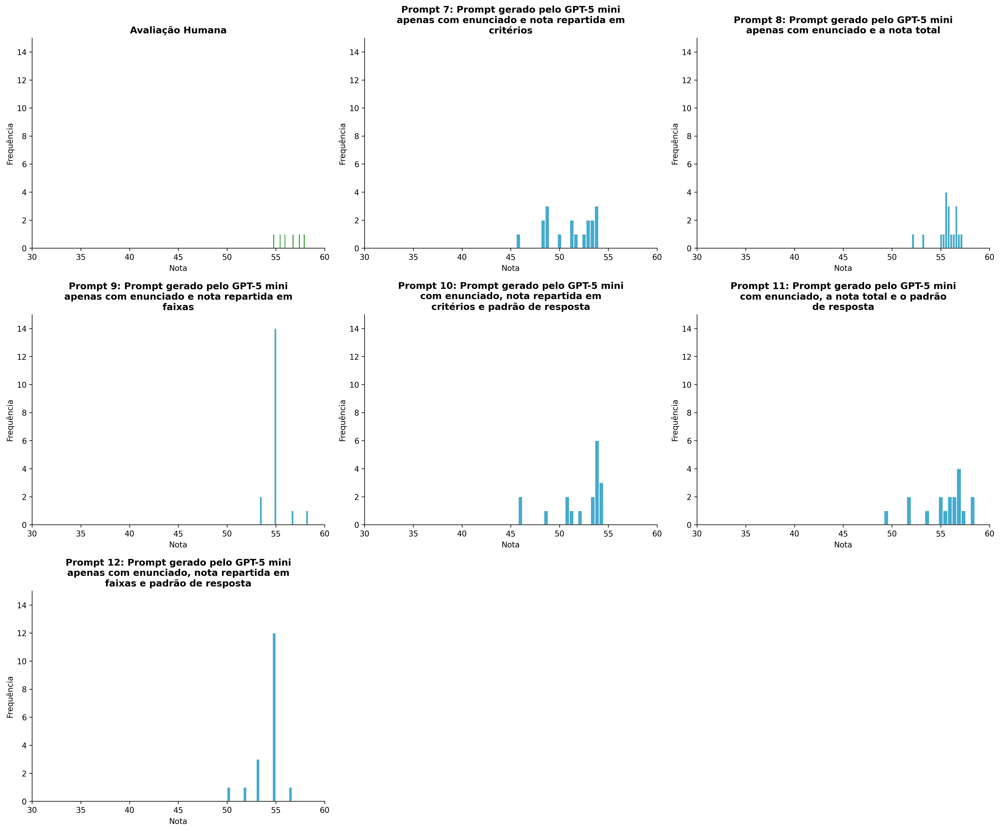
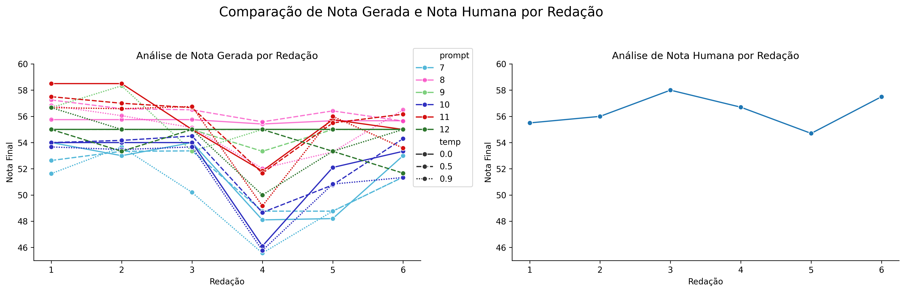
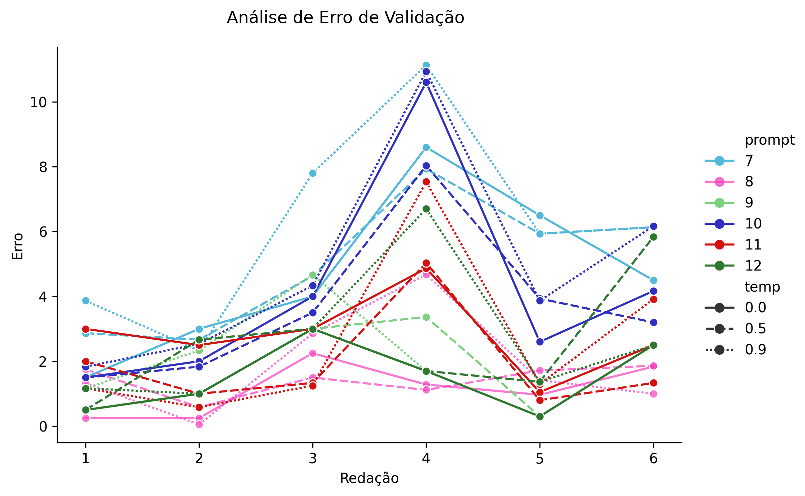
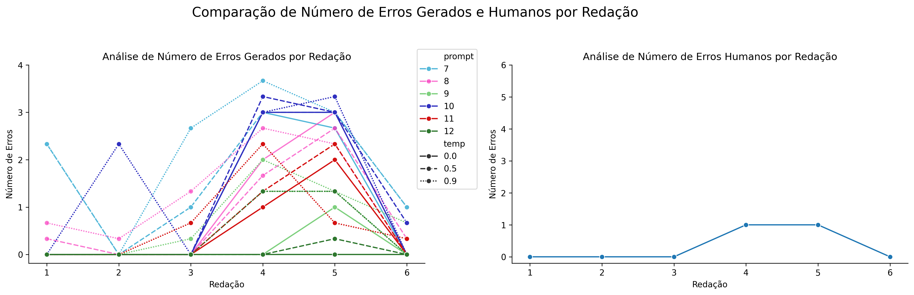

# Relatório de Avaliação: sabia v3.1 - 3 execuções
**Gerado em: 14/01/2026 20:51:22**

## 1. Distribuição de Notas
Nesta seção comparamos as notas atribuídas pelo modelo sabia em diferentes prompts/temperaturas versus a correção humana.

## 2. Comparação de Notas Geradas e Humanas
Nesta seção, apresentamos a comparação entre as notas finais geradas pelo modelo e as notas dadas por avaliadores humanos.

## 3. Análise de Erro de Validação

<table>
  <tr>
    <td>
      
    </td>
    <td>
      <table border="1" class="dataframe">
  <thead>
    <tr style="text-align: right;">
      <th></th>
      <th>prompt</th>
      <th>temp</th>
      <th>area_val_error</th>
    </tr>
  </thead>
  <tbody>
    <tr>
      <th>0</th>
      <td>7</td>
      <td>0.0</td>
      <td>25.1000</td>
    </tr>
    <tr>
      <th>1</th>
      <td>7</td>
      <td>0.5</td>
      <td>25.6666</td>
    </tr>
    <tr>
      <th>2</th>
      <td>7</td>
      <td>0.9</td>
      <td>32.1999</td>
    </tr>
    <tr>
      <th>3</th>
      <td>8</td>
      <td>0.0</td>
      <td>5.7917</td>
    </tr>
    <tr>
      <th>4</th>
      <td>8</td>
      <td>0.5</td>
      <td>6.7217</td>
    </tr>
    <tr>
      <th>5</th>
      <td>8</td>
      <td>0.9</td>
      <td>10.1667</td>
    </tr>
    <tr>
      <th>6</th>
      <td>9</td>
      <td>0.0</td>
      <td>7.5000</td>
    </tr>
    <tr>
      <th>7</th>
      <td>9</td>
      <td>0.5</td>
      <td>9.1667</td>
    </tr>
    <tr>
      <th>8</th>
      <td>9</td>
      <td>0.9</td>
      <td>10.8334</td>
    </tr>
    <tr>
      <th>9</th>
      <td>10</td>
      <td>0.0</td>
      <td>22.0334</td>
    </tr>
    <tr>
      <th>10</th>
      <td>10</td>
      <td>0.5</td>
      <td>19.6499</td>
    </tr>
    <tr>
      <th>11</th>
      <td>10</td>
      <td>0.9</td>
      <td>25.6666</td>
    </tr>
    <tr>
      <th>12</th>
      <td>11</td>
      <td>0.0</td>
      <td>14.1667</td>
    </tr>
    <tr>
      <th>13</th>
      <td>11</td>
      <td>0.5</td>
      <td>9.8333</td>
    </tr>
    <tr>
      <th>14</th>
      <td>11</td>
      <td>0.9</td>
      <td>13.2083</td>
    </tr>
    <tr>
      <th>15</th>
      <td>12</td>
      <td>0.0</td>
      <td>7.5000</td>
    </tr>
    <tr>
      <th>16</th>
      <td>12</td>
      <td>0.5</td>
      <td>11.9001</td>
    </tr>
    <tr>
      <th>17</th>
      <td>12</td>
      <td>0.9</td>
      <td>13.9001</td>
    </tr>
  </tbody>
</table>
    </td>
  </tr>
</table>

## 4. Análise de Erros Gramaticais
Comparação da sensibilidade do modelo na detecção/geração de erros em relação ao padrão humano.

## 4. Estatísticas Descritivas
### Modelo sabia v3.1
|       |    prompt |       temp |   redacao |   nota_final |        1A |        1B |        1C |     CGPL |   num_errors |
|:------|----------:|-----------:|----------:|-------------:|----------:|----------:|----------:|---------:|-------------:|
| count | 108       | 108        | 108       |    108       | 36        | 36        | 36        | 36       |   108        |
| mean  |   9.5     |   0.466667 |   3.5     |     53.9633  |  8.68983  |  8.71296  | 17.3194   | 16.9     |     0.827157 |
| std   |   1.71579 |   0.369895 |   1.71579 |      2.64664 |  0.421929 |  0.377152 |  0.954009 |  1.30185 |     1.13975  |
| min   |   7       |   0        |   1       |     45.5667  |  8        |  8        | 15        | 14.1     |     0        |
| 25%   |   8       |   0        |   2       |     53.3208  |  8.45833  |  8.3333   | 16.8333   | 16.0083  |     0        |
| 50%   |   9.5     |   0.5      |   3.5     |     55       |  8.83335  |  9        | 18        | 17.3     |     0        |
| 75%   |  11       |   0.9      |   5       |     55.5975  |  9        |  9        | 18        | 18       |     1.3333   |
| max   |  12       |   0.9      |   6       |     58.5     |  9.1667   |  9.1667   | 18.1667   | 18.1667  |     3.6667   |

### Humano
|       |   redacao |   nota_final |        1A |        1B |        1C |      CGPL |   num_errors |
|:------|----------:|-------------:|----------:|----------:|----------:|----------:|-------------:|
| count |   6       |      6       |  6        |  6        |  6        |  6        |     6        |
| mean  |   3.5     |     56.4     |  9.75     |  9.75     | 18.5      | 18.4      |     0.333333 |
| std   |   1.87083 |      1.24258 |  0.273861 |  0.273861 |  0.447214 |  0.532917 |     0.516398 |
| min   |   1       |     54.7     |  9.5      |  9.5      | 18        | 17.7      |     0        |
| 25%   |   2.25    |     55.625   |  9.5      |  9.5      | 18.125    | 18.05     |     0        |
| 50%   |   3.5     |     56.35    |  9.75     |  9.75     | 18.5      | 18.35     |     0        |
| 75%   |   4.75    |     57.3     | 10        | 10        | 18.875    | 18.875    |     0.75     |
| max   |   6       |     58       | 10        | 10        | 19        | 19        |     1        |
